# Лабрадорная работа № 1 — свой Docker

Первоисточник: [условие лабораторной работы](https://github.com/KeladKaal/containerization-and-orchestration/blob/main-rus/lecture-1-docker/lab.md).

Цель работы — последовательно воспроизвести основные механизмы контейнерного
runtime средствами Linux и сравнить результат с запуском через Docker.

## Окружение

- ОС: Linux Mint;
- ядро: Linux 7.0.0-28-generic, x86_64;
- cgroups: cgroup v2;
- язык сервиса: Go 1.25.6.

## Часть 0 — тестовый HTTP-сервис

Вспомогательный `api` сервис реализован на Go. Предоставляет три эндпоинта:

- `GET /health` возвращает `ok`;
- `GET /eat?mb=N` выделяет и удерживает `N` МиБ памяти;
- `GET /burn` запускает бесконечный цикл, нагружающий одно ядро CPU.

Для эксперимента с памятью сервис не только выделяет срез байтов, но и обращается
к каждой странице памяти. Ссылки на выделенные блоки сохраняются, поэтому сборщик
мусора Go не может освободить их до завершения процесса.

## Часть 1 — запуск напрямую

Сервис собран в отдельный бинарник и запущен напрямую, без контейнерного рантайма:

```bash
cd lab-01-docker/api
go build -o /tmp/lab1-api .
/tmp/lab1-api
```

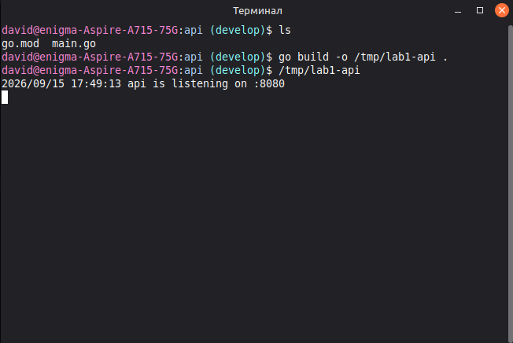

Проверка `GET /health` вернула HTTP 200 и строку `ok`:

```bash
curl -i http://127.0.0.1:8080/health
```

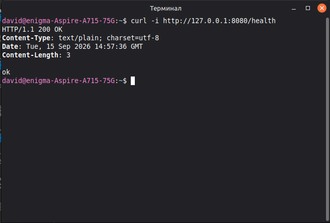

### Процесс с точки зрения хоста

Имя запущенного бинарного файла — `lab1-api`. Зная его, можно найти PID процесса:

```bash
pgrep -a -x lab1-api
```

Опция `-x` требует точного совпадения имени процесса, а `-a` добавляет к PID
команду запуска. Во время эксперимента команда вывела:

```text
185525 /tmp/lab1-api
```

Чтобы не подставлять найденное число в следующие команды вручную, PID был забинджен
в переменную `pid` и сразу выведен для проверки:

```bash
pid=$(pgrep -n -x lab1-api)
echo "$pid"
```

Опция `-n` выбирает самый новый процесс, если процессов с таким именем несколько.
Конструкция `$(...)` подставляет результат `pgrep` в переменную.

После этого процесс был просмотрен со стороны хоста:

```bash
ps -f -p "$pid"
```

Во время эксперимента процесс имел PID `185525` и был запущен от пользователя
`david`. Это обычный PID хоста, так как отдельный PID namespace еще не создавался.

Команда `ps` без аргументов не показывала `api`, потому что по умолчанию выбирала
процессы, связанные с текущим терминалом. Сервис был запущен в другом терминале.
Поиск через `pgrep` не ограничивался текущим TTY и нашел процесс по имени.

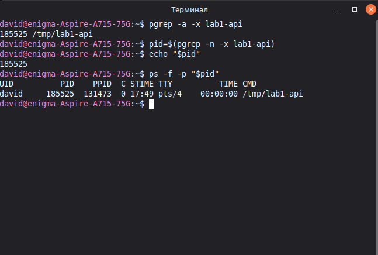

### Исходное состояние cgroup

В cgroup v2 каждый процесс обязательно принадлежит некоторой cgroup. При прямом
запуске `api` попал в systemd scope терминала, однако отдельная группа с лимитами
для лабораторной еще не создавалась.

Текущая cgroup процесса была прочитана из `/proc`:

```bash
cat "/proc/$pid/cgroup"
```

В cgroup v2 строка начинается с `0::`, а после второго двоеточия находится нужный
путь. Чтобы использовать его дальше, путь был сохранен в отдельную переменную:

```bash
cgroup_path=$(cut -d: -f3 "/proc/$pid/cgroup")
echo "$cgroup_path"
```

Значение `memory.max` в найденной cgroup было проверено командой:

```bash
cat "/sys/fs/cgroup${cgroup_path}/memory.max"
```

Команда вернула `max`, то есть отдельный предел памяти на этом уровне отсутствовал.

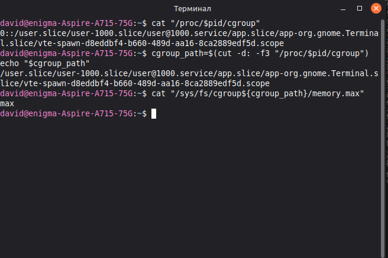

Файла `cpu.max` в scope процесса не оказалось. Чтобы последовательно найти
ближайшего предка с CPU-контроллером, сначала были получены родительские пути:

```bash
terminal_slice=$(dirname "$cgroup_path")
app_slice=$(dirname "$terminal_slice")
echo "$app_slice"
```

Затем были проверены доступные контроллеры `app.slice`, контроллеры, переданные
его дочерним cgroup, и собственная CPU-квота `app.slice`:

```bash
cat "/sys/fs/cgroup${app_slice}/cgroup.controllers"
cat "/sys/fs/cgroup${app_slice}/cgroup.subtree_control"
cat "/sys/fs/cgroup${app_slice}/cpu.max"
```

Получен следующий результат:

```text
cpu memory pids
memory pids
max 100000
```

Файл `cgroup.controllers` показывает, что CPU-контроллер доступен в `app.slice`
для передачи ниже. При этом в `cgroup.subtree_control` перечислены только `memory`
и `pids`: CPU-контроллер не был передан дочерним cgroup. Поэтому в terminal scope,
где находился процесс, файл `cpu.max` отсутствовал.

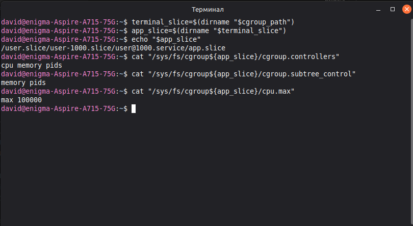

Значение `max` у `app.slice` означает отсутствие CPU-квоты, а `100000` — период
ее учета в микросекундах. Иерархические и общесистемные ограничения по-прежнему
могут действовать, но собственных лимитов CPU и памяти для `api` на этом этапе нет.

### Вывод

Работающий сервис пока является обычным процессом хоста: он использует PID
namespace и сеть хоста и не имеет заданных в рамках лабораторной ограничений
ресурсов. Успешный `/health` подтверждает функциональность сервиса, но не наличие
изоляции.

## Часть 2 — namespaces

Для процесса были созданы отдельные namespaces шести типов:

| Namespace | Что изолировано |
| --- | --- |
| `pid` | Нумерация и видимость процессов |
| `mnt` | Таблица монтирований и отдельный `/proc` |
| `net` | Интерфейсы, маршруты, сокеты и порты |
| `uts` | Имя хоста |
| `ipc` | System V IPC и POSIX message queues |
| `user` | Отображение UID/GID и связанные с ним права |

Итоговый запуск со всеми namespaces выглядел так:

```bash
unshare \
  --user --map-root-user \
  --pid --fork \
  --mount --mount-proc \
  --uts \
  --ipc \
  --net \
  --kill-child \
  bash -c 'hostname lab1-api; exec /tmp/lab1-api'
```

`--fork` запускает `bash` первым процессом нового PID namespace. После установки
hostname команда `exec` заменяет этот же процесс кодом `api`, не меняя его PID,
поэтому именно `api` остаётся PID 1.

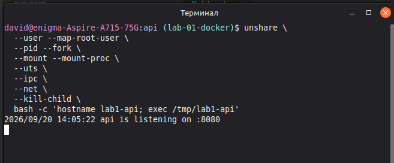

### PID и mount namespaces

Снаружи `api` был виден как обычный процесс с рандомным большим PID. Поле `NSpid` в
`/proc/<pid>/status` показало два номера одного процесса:

```text
NSpid:  3352039  1
```

Первый номер действителен в PID namespace хоста, второй — во вложенном namespace.
Это разные имена одной задачи на
разных уровнях видимости.

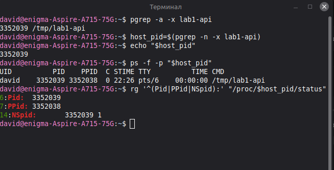

Новый `/proc` был смонтирован внутри отдельного mount namespace. `procfs` — это
формируемое ядром виртуальное представление, связанное с PID namespace, а не
обычный каталог с сохранёнными на диске данными. Благодаря новому mount команда
`ps` внутри показала только `api` с PID 1, shell и саму команду `ps`.

Для входа использовался `nsenter`. Первая попытка, конечно, завершилась ошибкой
`setgroups failed`, потому что непривилегированное отображение GID установило
`setgroups=deny`. Параметр `--preserve-credentials` запретил `nsenter` повторно
менять группы и позволил войти с уже настроенным отображением UID/GID:

```bash
nsenter \
  --target "$host_pid" \
  --user --mount --pid \
  --preserve-credentials \
  -- bash
```

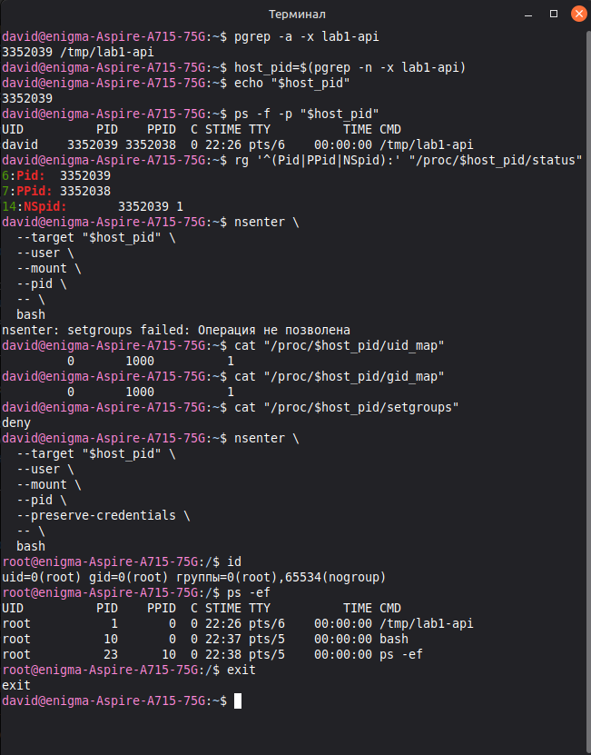

### UTS и user namespaces

После создания UTS namespace процессу было присвоено имя хоста `lab1-api`.
Настоящий hostname ноута остался `enigma-Aspire-A715-75G`.

User namespace отобразил UID 0 внутри на UID 1000 снаружи:

```text
внутренний UID 0 → внешний UID 1000
```

Поэтому снаружи процесс принадлежал пользователю `david`, а внутри `id` показывал
`root`. Права root при этом действовали относительно созданных namespaces; для
объектов хоста ядро продолжало учитывать внешний UID 1000.

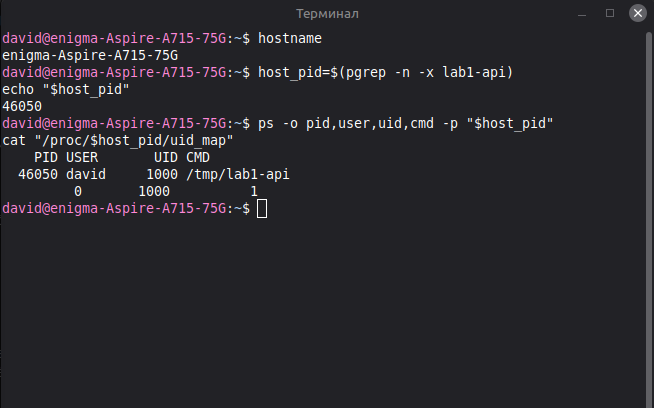

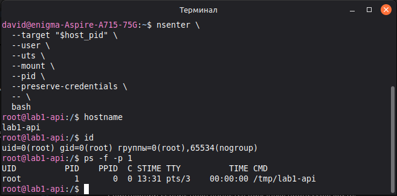

### IPC namespace

Для проверки на хосте была создана System V message queue:

```bash
host_queue_id=$(ipcmk -Q | awk '{print $NF}')
ipcs -q
```

Изнутри нового IPC namespace хостовая очередь была не видна. Созданная внутри
очередь также получила `msqid=0`, однако это был другой объект ядра в другом
реестре IPC. Хост продолжал видеть только собственную очередь с тем же числовым
идентификатором.

System V IPC-объект не принадлежит процессу, который его создал, и не исчезает
после завершения `ipcmk`. Хостовая очередь была удалена явно:

```bash
ipcrm -q "$host_queue_id"
```

Внутренняя очередь исчезла при уничтожении её IPC namespace.

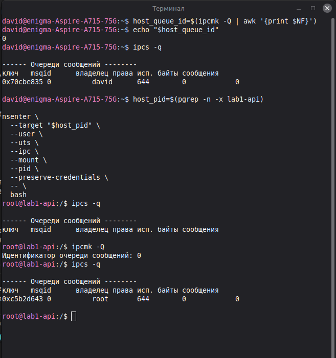

### Network namespace

После добавления `--net` сервис получил отдельный сетевой стек. Запрос к
`127.0.0.1:8080` с хоста завершился ошибкой: loopback хоста не имеет отношения к
loopback внутри namespace.

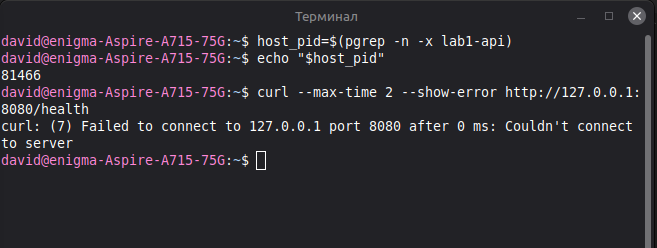

Изначально внутри присутствовал только интерфейс `lo` в состоянии `DOWN`, а
таблица маршрутизации была пуста. После включения внутреннего loopback сервис стал
доступен из своего network namespace:

```bash
ip link set lo up
curl -i http://127.0.0.1:8080/health
```

Запрос вернул HTTP 200 и `ok`. Это не создало соединения с хостом или интернетом:
для него потребовались бы `veth`, IP-адреса, маршруты и forwarding/NAT либо сетевой
мост.

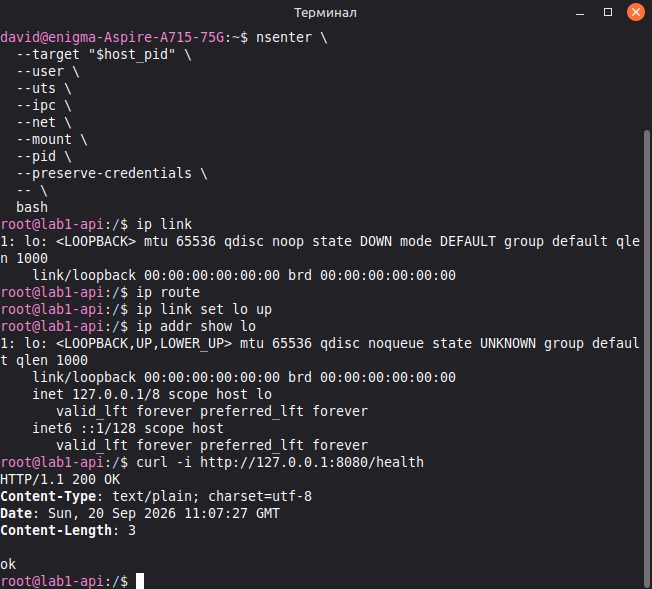

### Вывод

Namespaces изменили представление процесса о системе, но не создали отдельное
ядро. Хост по-прежнему видел тот же процесс, тогда как изнутри он был PID 1,
root с отдельным hostname, IPC-реестром и сетевым стеком. Ограничений потребления
ресурсов namespaces не добавили — это задача cgroups.

## Часть 3 — cgroup v2

Namespaces ограничивают видимость, но не потребление ресурсов. Для проверки
контроллеров cgroup v2 сервис запускался напрямую: каждый эксперимент изолировал
один механизм, а объединение с namespaces выполняется далее в общем скрипте.

### Ограничение памяти и OOM

Для API была создана cgroup с пределом 64 МиБ, запрещённым swap и групповым OOM:

```bash
sudo mkdir /sys/fs/cgroup/lab1-memory
echo $((64 * 1024 * 1024)) | sudo tee /sys/fs/cgroup/lab1-memory/memory.max
echo 0 | sudo tee /sys/fs/cgroup/lab1-memory/memory.swap.max
echo 1 | sudo tee /sys/fs/cgroup/lab1-memory/memory.oom.group

pid=$(pgrep -n -x lab1-api)
echo "$pid" | sudo tee /sys/fs/cgroup/lab1-memory/cgroup.procs
```

Перед нагрузкой проверялось, что текущий PID действительно находится в
`/lab1-memory`, а счётчики `memory.events` равны нулю. Запрос на выделение и
удержание 80 МиБ превысил лимит:

```bash
curl --max-time 10 --show-error 'http://127.0.0.1:8080/eat?mb=80'
```

Соединение завершилось без ответа, а процесс получил `SIGKILL`:

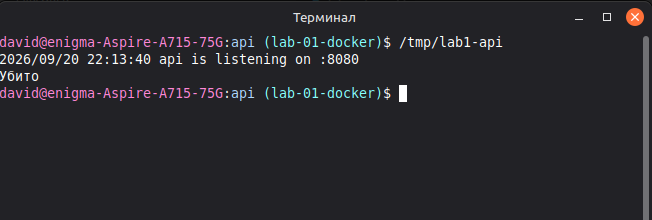

Счётчики после запроса показали `oom=1`, ненулевой `oom_kill` и
`oom_group_kill=1`; `cgroup.procs` опустел. Значение `max=37` означает количество
неудачных начислений памяти сверх `memory.max`, а не число HTTP-запросов.

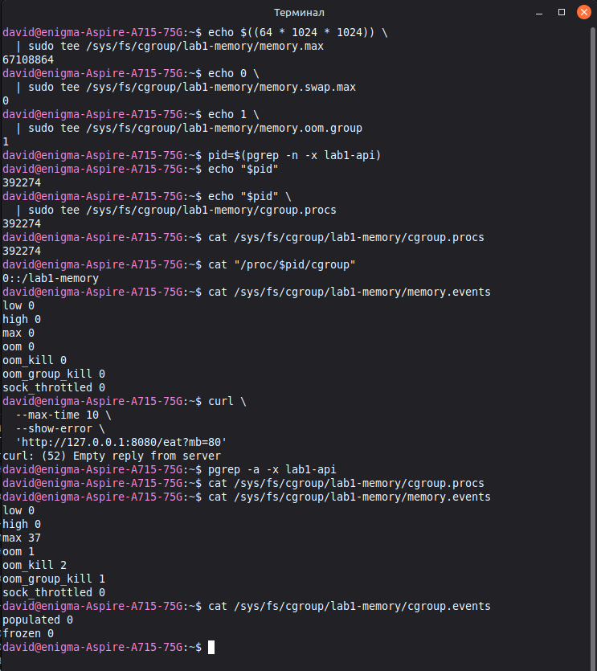

При первой проверке после OOM API был запущен повторно (тк не сделал скрин), но новый PID не был
перемещен в `lab1-memory`. Поэтому несколько запросов успешно выделили память.
Это показало, что cgroup связывается с экземпляром процесса, а не с именем
бинарника: новый процесс наследует cgroup своего родителя либо должен быть явно
перемещен. Эксперимент был повторен с проверкой `cgroup.procs` и
`/proc/<pid>/cgroup`.

`memory.events` является набором счетчиков memory controller.
Ошибка `curl` доказывает только потерю соединения, а увеличение `oom_kill`
однозначно связывает завершение с OOM внутри этой cgroup. (кстати сам контроллер процесс
не перезапускает, но в Kubernetes завершение обычно обнаруживает kubelet/runtime и применяет
restart policy).

### CPU throttling

Для CPU была задана квота 50 000 мкс на период 100 000 мкс:

```bash
sudo mkdir /sys/fs/cgroup/lab1-cpu
echo '50000 100000' | sudo tee /sys/fs/cgroup/lab1-cpu/cpu.max
pid=$(pgrep -n -x lab1-api)
echo "$pid" | sudo tee /sys/fs/cgroup/lab1-cpu/cgroup.procs
```

Это соответствует половине одного CPU. До нагрузки счетчики throttling были
нулевыми:

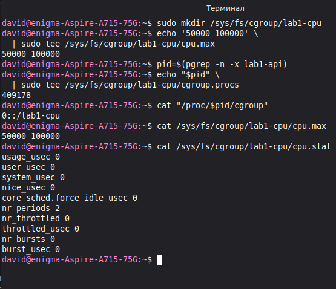

Нагрузка запускалась по ручке `/burn`:

```bash
curl http://127.0.0.1:8080/burn
```

Процесс продолжил работать, но после исчерпания 50 мс квоты в очередном периоде
ядро откладывало его выполнение до следующего периода. В `cpu.stat` выросли
`nr_throttled` и `throttled_usec`:

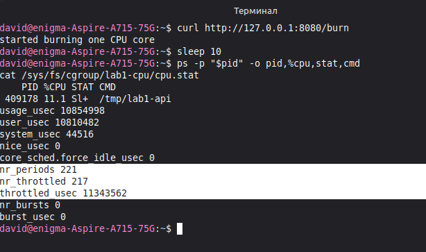

Повторная проверка показала дальнейший рост счетчиков: `nr_periods` изменился с
221 до 825, а `nr_throttled` — с 217 до 821. Практически каждый период cgroup
упиралась в квоту.

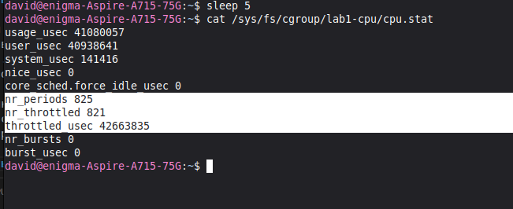

Показание `%CPU` обычной команды `ps` было ниже 50%, потому что это среднее за всё
время жизни процесса, включая простой до запуска `/burn`. Фактическое срабатывание
лимита подтверждают счётчики контроллера, а не единичное показание `ps`.

### Ограничение числа процессов

Для безопасной проверки fork-нагрузки была создана отдельная cgroup с пределом
20 задач:

```bash
sudo mkdir /sys/fs/cgroup/lab1-pids
echo 20 | sudo tee /sys/fs/cgroup/lab1-pids/pids.max
```

В cgroup был перемещён дочерний shell. Все запущенные им процессы автоматически
наследовали ту же cgroup и её лимит:

```bash
# Терминал 1
bash
echo $$
```

```bash
# Терминал 2
shell_pid=<PID_ИЗ_ПЕРВОГО_ТЕРМИНАЛА>
echo "$shell_pid" | sudo tee /sys/fs/cgroup/lab1-pids/cgroup.procs
```

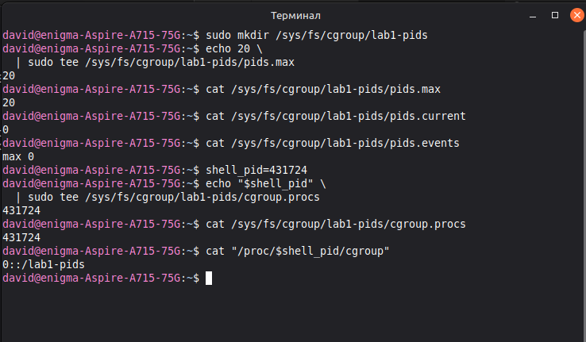

Из дочернего shell была запущена нагрузка:

```bash
stress-ng --fork 100 --timeout 10s --metrics-brief
```

`stress-ng` попытался запустить 100 workers, но cgroup заполнилась ровно до
`pids.current=20`. Счётчик `max` в `pids.events` вырос до сотен тысяч: каждая
такая запись означает отклонённый ядром `fork/clone`.

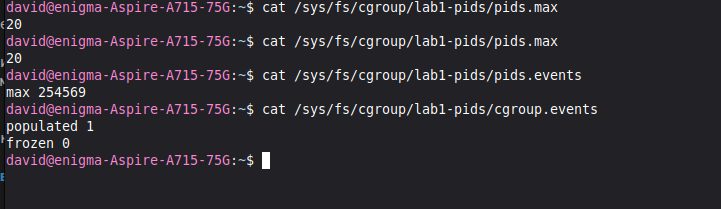

Нагрузка остановлена через `Ctrl+C`. Существующие процессы не были убиты, а после
их завершения `pids.current` вернулся к одному; накопленный счётчик отказов
сохранился.

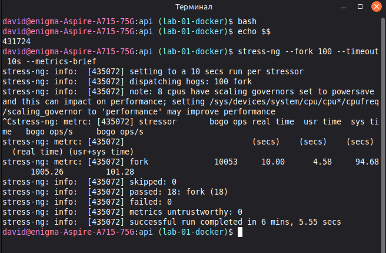

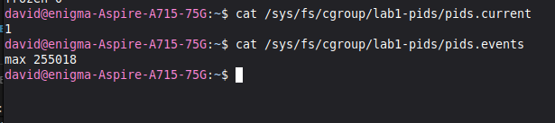

### Вывод

| Ресурс | Настройка | Поведение при достижении предела | Доказательство |
| --- | --- | --- | --- |
| Память | `memory.max` | OOM и принудительное завершение | `memory.events:oom_kill` |
| CPU | `cpu.max` | Приостановка до следующего периода | `cpu.stat:nr_throttled` |
| Процессы | `pids.max` | Отказ нового `fork/clone` | `pids.events:max` |

Cgroups ограничили то, что namespaces принципиально не контролируют: объем
памяти, процессорное время и число создаваемых задач.

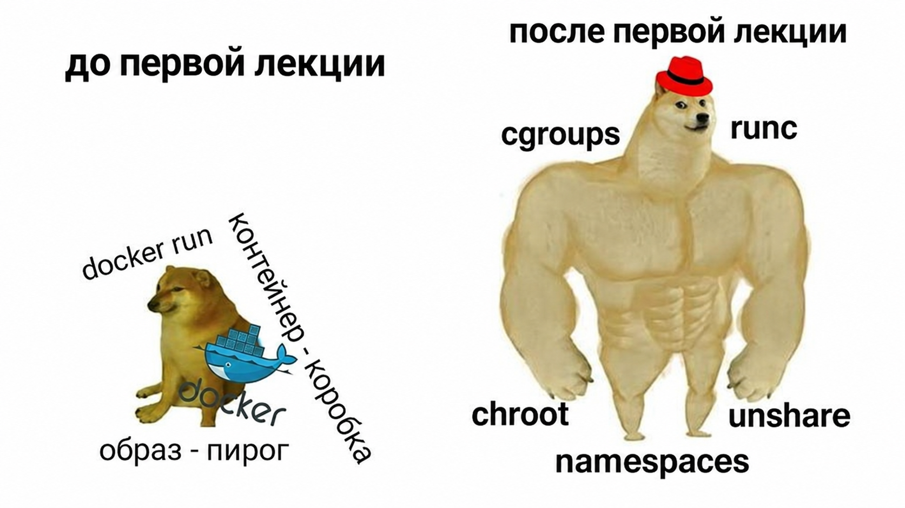

## Часть 4 — права процесса

Namespaces и cgroups сами по себе не отвечают на вопрос, какие операции процессу
разрешено просить у ядра. Для ограничения прав были отдельно проверены два
механизма: capabilities и seccomp.

### Linux capabilities

Сначала был создан user namespace вместе с отдельным UTS namespace:

```bash
unshare --user --map-root-user --uts bash
```

Внутри процесса `id` показывал `uid=0(root)`, а в effective-наборе присутствовали
capabilities. В частности, `CAP_SYS_ADMIN` позволила изменить hostname внутри
UTS namespace:

```bash
hostname capability-demo
```

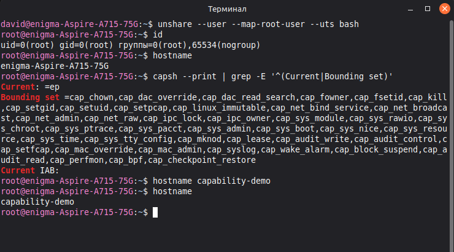

Затем наборы capabilities были очищены перед запуском нового shell:

```bash
setpriv \
  --bounding-set=-all \
  --inh-caps=-all \
  --ambient-caps=-all \
  --no-new-privs \
  sh -c '
    id
    capsh --print | grep -E "^(Current|Bounding set)"
    hostname should-not-work
  '
```

`id` по-прежнему показывал UID 0, однако `Current` и `Bounding set` оказались
пустыми, а смена hostname завершилась отказом. Повторная проверка показала, что
имя осталось `capability-demo`.

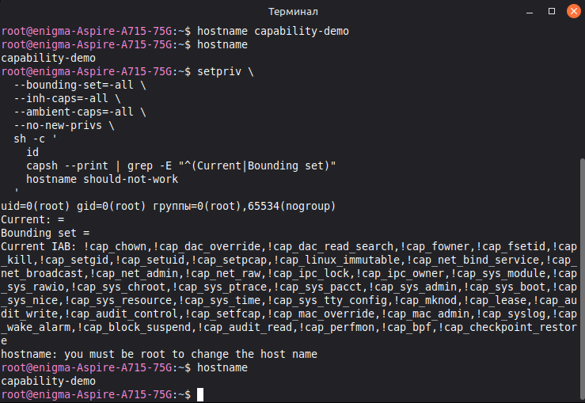

Таким образом, UID 0 описывает идентичность процесса, но сам по себе не гарантирует
право на привилегированную операцию. Ядро дополнительно проверяет соответствующую
capability в effective-наборе. Bounding set ограничивает capabilities, которые
можно получить при последующем `exec`, а `no_new_privs` запрещает этому `exec`
повышать привилегии через setuid-бинарник или file capabilities.

Тестовому API не нужны привилегированные операции: он слушает непривилегированный
порт 8080, выделяет память и создаёт CPU-нагрузку. Поэтому для него допустим
пустой набор capabilities.

### Seccomp

Capabilities ограничивают привилегированные действия, но не задают общий список
доступных системных вызовов. Для проверки seccomp создан
[`seccomp-profile.json`](seccomp-profile.json):

```json
{
  "defaultAction": "SCMP_ACT_ALLOW",
  "syscalls": [
    {
      "names": ["unshare", "setns"],
      "action": "SCMP_ACT_ERRNO",
      "errnoRet": 1
    }
  ]
}
```

Это демонстрационный denylist, а не production allowlist: остальные syscalls
разрешены, а попытки вызвать `unshare(2)` или `setns(2)` отклоняются с
`errno=1` (`EPERM`).

JSON-файл сам не может загрузить фильтр в ядро. Установленный в системе `setpriv`
не поддерживает seccomp-фильтры, поэтому для воспроизводимого эксперимента написан
небольшой [`seccomp-launcher.py`](seccomp-launcher.py). Он читает профиль,
создаёт фильтр через `libseccomp`, загружает его и выполняет целевую команду через
`exec`.

Без фильтра `unshare` успешно создал user namespace. Запуск той же команды через
launcher завершился ошибкой `Operation not permitted`:

```bash
unshare --user --map-root-user true \
  && echo "unshare without seccomp: allowed"

python3 seccomp-launcher.py \
  seccomp-profile.json \
  unshare --user --map-root-user true
```

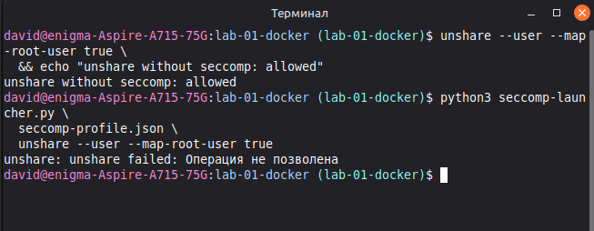

После этого через тот же launcher был запущен API:

```bash
python3 seccomp-launcher.py seccomp-profile.json /tmp/lab1-api
```

Эндпоинт `/health` продолжил отвечать HTTP 200. Состояние процесса в `/proc`
подтвердило, что фильтр действительно действует уже после `exec`:

```text
NoNewPrivs:       1
Seccomp:          2
Seccomp_filters:  1
```

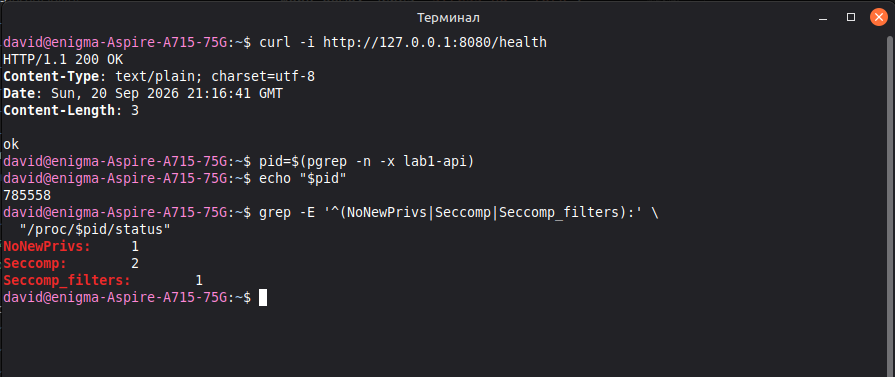

`exec` заменил код launcher кодом API, но не создал новый процесс: сохранились PID
и связанное с процессом seccomp-состояние. Поэтому API унаследовал фильтр и не
может ослабить его. Значение `Seccomp: 2` означает filter mode, а
`NoNewPrivs: 1` запрещает получить новые привилегии через последующие `exec`.

### Вывод

Capabilities и seccomp решают разные задачи и дополняют друг друга:

| Механизм | Что ограничивает | Результат эксперимента |
| --- | --- | --- |
| Capabilities | Отдельные классы привилегированных операций | UID 0 без нужной capability не смог изменить hostname |
| Seccomp | Вход в конкретные syscalls | `unshare(2)` получил `EPERM`, при этом API продолжил работать |

Даже наличие `CAP_SYS_ADMIN` не позволило бы обойти запрещённый seccomp syscall:
фильтр проверяется при входе в системный вызов независимо от UID и capabilities.

## Часть 5 — свой Docker

Команды из предыдущих частей были собраны в единый
[`mydocker.sh`](mydocker.sh). Это еще не production runtime (да и Docker после
этой лабы спит спокойно), но скрипт одной командой запускает API с изоляцией,
лимитами и урезанными правами.

### Сборка mini-runtime

Скрипт создаёт одну cgroup `lab1-mydocker`, в которой одновременно включены все
проверенные ограничения:

| Контроллер | Значение |
| --- | --- |
| `memory.max` | 64 МиБ (`67108864`) |
| `memory.swap.max` | `0` |
| `memory.oom.group` | `1` |
| `cpu.max` | `50000 100000` (половина CPU) |
| `pids.max` | `20` |

Затем `unshare` создаёт user, PID, mount, UTS, IPC и network namespaces. Между
созданием процесса и запуском API установлен синхронизационный барьер на FIFO:

```text
unshare создаёт bash → bash блокируется на read из FIFO
                    → host находит PID bash
                    → host записывает PID в cgroup.procs
                    → host пишет start в FIFO
                    → bash продолжает запуск
```

Барьер устраняет гонку: API не успеет выделить память или создать процессы до
попадания под лимиты. `read` является встроенной командой Bash, поэтому во время
ожидания не появляется дополнительный дочерний процесс вне cgroup.

После открытия барьера процесс устанавливает hostname `lab1-api` и включает
внутренний loopback. Эти операции выполняются до сброса capabilities, пока у root
в user namespace ещё есть необходимые полномочия. Затем цепочка `exec` выглядит
так:

```text
bash PID 1
  → setpriv без capabilities и с no_new_privs
  → seccomp-launcher.py
  → lab1-api PID 1
```

`exec` не создаёт новый процесс, поэтому API сохраняет PID 1, namespaces и
принадлежность к cgroup. При `Ctrl+C` trap останавливает `unshare`, завершает
оставшиеся процессы через `cgroup.kill`, удаляет cgroup и временный FIFO.

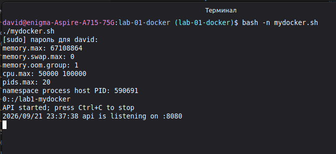

Снаружи API имел обычный host PID, а `NSpid` показывал тот же процесс как PID 1
внутри. Путь `/proc/<pid>/cgroup` подтвердил членство в `/lab1-mydocker`.
Хостовый loopback сервис не видел, но запрос через `nsenter` в network namespace
вернул HTTP 200:

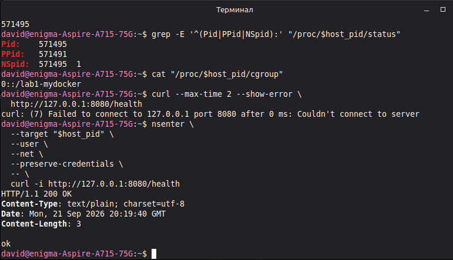

Итоговый процесс получил пустые capability-наборы, `NoNewPrivs: 1` и
`Seccomp: 2`. При этом hostname и `/health` продолжили работать:

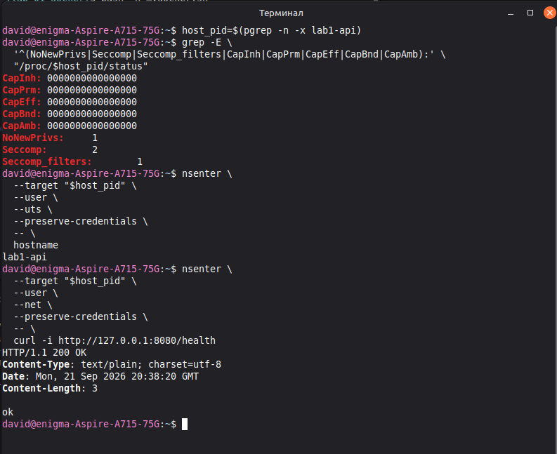

### Запуск через Docker

Чтобы на этом этапе не забегать к Dockerfile из части 6, уже собранный бинарник
был смонтирован read-only в имевшийся локально образ `ubuntu:22.04`. Требуемая
бинарником версия glibc не превышала `GLIBC_2.34` и была совместима с образом.

Docker-контейнер запущен с теми же лимитами и моделью прав:

```bash
sudo docker run \
  --rm \
  --name lab1-docker \
  --hostname lab1-api \
  --memory 64m \
  --memory-swap 64m \
  --cpus 0.5 \
  --pids-limit 20 \
  --cap-drop ALL \
  --security-opt no-new-privileges=true \
  --security-opt "seccomp=$PWD/seccomp-profile.json" \
  --publish 127.0.0.1:8080:8080 \
  --mount type=bind,src=/tmp/lab1-api,dst=/lab1-api,readonly \
  ubuntu:22.04 \
  /lab1-api
```

Значение `--memory-swap` равно `--memory`, поэтому дополнительный swap контейнеру
не предоставляется. Пользовательский seccomp-профиль заменил встроенный профиль
Docker специально для сравнения с `mydocker.sh`.

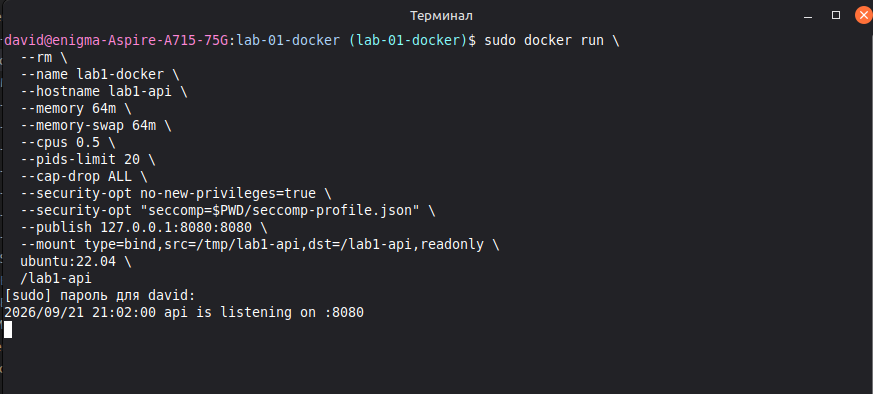

Публикация `127.0.0.1:8080:8080` сделала сервис доступным с хоста, несмотря на
отдельный network namespace. API получил PID 1 внутри и PID `616095` снаружи.
Docker с cgroup driver `systemd` поместил контейнер в отдельный scope:

```text
/system.slice/docker-<container-id>.scope
```

Чтение файлов cgroup v2 подтвердило, что высокоуровневые флаги Docker превратились
в те же настройки ядра:

```text
memory.max:      67108864
memory.swap.max: 0
cpu.max:         50000 100000
pids.max:        20
```

Изнутри контейнера были также подтверждены hostname, PID 1, нулевые `CapEff` и
`CapBnd`, `NoNewPrivs: 1` и seccomp filter mode.

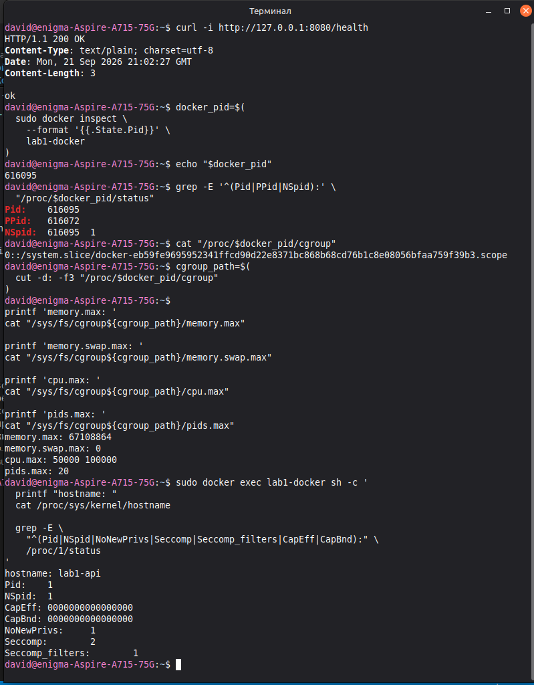

### Сравнение

| Область | `mydocker.sh` | Docker |
| --- | --- | --- |
| Namespaces | Создаются напрямую через `unshare` | Настраиваются OCI runtime `runc` |
| Cgroups | Фиксированная cgroup создаётся и удаляется скриптом | `dockerd` управляет systemd scope и метаданными контейнера |
| Ресурсы | Прямая запись в файлы cgroup v2 | Флаги CLI преобразуются в те же файлы cgroup v2 |
| Права | `setpriv` и отдельный Python launcher | OCI-конфигурация для capabilities, `no_new_privs` и seccomp |
| Сеть | Только отдельный `lo`, связи с хостом нет | `veth`, bridge и правила публикации портов |
| Файловая система | Новая mount table и `/proc`, но корень хоста остаётся видимым | Отдельный rootfs из слоёв образа и управляемые mounts |
| Дополнительная защита | AppArmor и cgroup namespace не настроены | Доступны AppArmor (`docker-default`) и отдельный cgroup namespace |
| Жизненный цикл | Shell, поиск дочернего PID и cleanup через trap | Daemon, имена, inspect, logs, автоматическое удаление через `--rm` |
| PID 1 | API является PID 1 | API также PID 1; init появится только с `--init` |

Совпадение низкоуровневых значений показало, что Docker не заменяет namespaces и
cgroups каким-то отдельным механизмом: он системно собирает их вместе и добавляет
сеть, rootfs, политики безопасности, метаданные и управление жизненным циклом.
Оба варианта по-прежнему используют общее ядро хоста.
