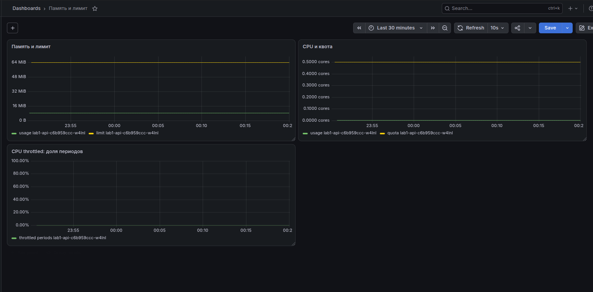
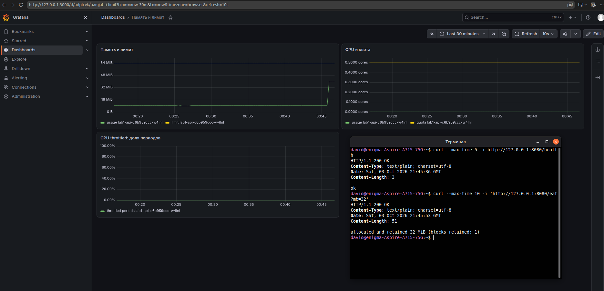
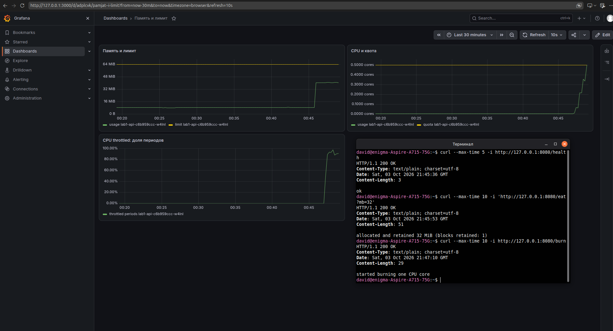
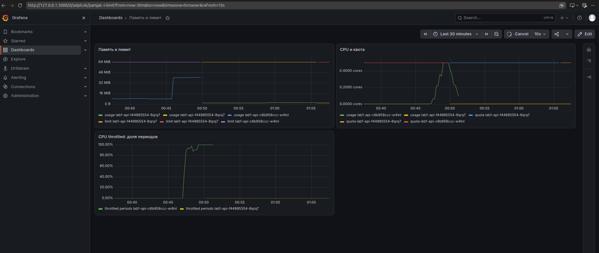

# Лабораторная работа № 1 - свой Docker

[Условие лабораторной работы](https://github.com/KeladKaal/containerization-and-orchestration/blob/main-rus/lecture-1-docker/lab.md).

Цель: запустить HTTP-сервис, последовательно добавить namespaces, cgroups и
ограничения прав, собрать собственный launcher и сравнить его с Docker.
Дополнительно проверил образы, хранение данных, gVisor и мониторинг контейнера.

## Окружение

- ОС: Linux Mint, x86_64.
- Ядро: Linux `7.0.0-28-generic`.
- Cgroups: v2.
- Язык сервиса: Go `1.25.6`.

Команды выполнялись в разные моменты, поэтому PID в проверках различаются.
Вывод терминала сокращен до значимых строк. Исходные
[скриншоты](docs/screenshots) сохранены отдельно; графики приведены в части 8.

## Часть 0 - HTTP-сервис

Код: [api/main.go](api/main.go).

| Endpoint | Поведение |
| --- | --- |
| `GET /health` | Возвращает `ok` |
| `GET /eat?mb=N` | Выделяет и удерживает N МиБ памяти |
| `GET /burn` | Запускает бесконечный цикл в фоновой goroutine |

`/eat` обращается к каждой выделенной странице. Ссылки на блоки сохраняются в
глобальном срезе, поэтому сборщик мусора не освобождает их после HTTP-запроса.

## Часть 1 - запуск без изоляции

Собрал и запустил сервис в отдельном терминале:

```bash
cd lab-01-docker/api
go build -o /tmp/lab1-api .
/tmp/lab1-api
```

Проверил доступность:

```console
$ curl -i http://127.0.0.1:8080/health
HTTP/1.1 200 OK
Content-Type: text/plain; charset=utf-8
Content-Length: 3

ok
```

PID `185525` сохранил в переменную `pid`. Вывод `ps -f -p "$pid"`:

```text
UID        PID    PPID  C STIME TTY      TIME     CMD
david   185525  131473  0 17:49 pts/4    00:00:00 /tmp/lab1-api
```

### Исходная cgroup

Получил путь cgroup и проверил лимит памяти:

```console
$ cat "/proc/$pid/cgroup"
0::/user.slice/user-1000.slice/user@1000.service/app.slice/app-org.gnome.Terminal.slice/vte-spawn-d8eddbf4-b660-489d-aa16-8ca2889edf5d.scope
$ cgroup_path=$(cut -d: -f3 "/proc/$pid/cgroup")
$ cat "/sys/fs/cgroup${cgroup_path}/memory.max"
max
```

Процесс находится в systemd scope терминала. `memory.max=max` означает, что
отдельный потолок памяти на этом уровне не задан.

В scope не было `cpu.max`, поэтому проверил родительский `app.slice`:

```console
$ terminal_slice=$(dirname "$cgroup_path")
$ app_slice=$(dirname "$terminal_slice")
$ cat "/sys/fs/cgroup${app_slice}/cgroup.controllers"
cpu memory pids
$ cat "/sys/fs/cgroup${app_slice}/cgroup.subtree_control"
memory pids
$ cat "/sys/fs/cgroup${app_slice}/cpu.max"
max 100000
```

CPU controller доступен родителю, но не включен для его дочерних cgroups.
У `app.slice` CPU quota также не задана; ограничения выше по иерархии возможны.

Вывод: API работает как обычный процесс хоста, с общей сетью и PID namespace,
без собственных лимитов ресурсов. Ответ `/health` подтверждает доступность
сервиса, но не доказывает изоляцию.

## Часть 2 - namespaces

| Namespace | Что изолирует |
| --- | --- |
| `pid` | Нумерацию и видимость процессов |
| `mnt` | Таблицу монтирований |
| `net` | Интерфейсы, маршруты, сокеты и порты |
| `uts` | Имя хоста |
| `ipc` | System V IPC и POSIX message queues |
| `user` | Отображение UID/GID и область действия capabilities |

Итоговая команда запуска:

```bash
unshare \
  --user --map-root-user \
  --pid --fork \
  --mount --mount-proc \
  --uts \
  --ipc \
  --net \
  --kill-child \
  bash -c 'hostname lab1-api; exec /tmp/lab1-api'
```

`exec` заменяет shell кодом API без создания нового процесса, поэтому сервис
становится PID 1 в новом PID namespace.

### PID снаружи и изнутри

Сохранил внешний PID в `host_pid`. Фрагмент проверки с хоста:

```console
$ ps -f -p "$host_pid"
UID        PID     PPID  C STIME TTY      TIME     CMD
david  3352039  3352038  0 22:26 pts/6    00:00:00 /tmp/lab1-api
$ grep -E '^(Pid|PPid|NSpid):' "/proc/$host_pid/status"
Pid:    3352039
PPid:   3352038
NSpid:  3352039  1
```

Зашел в namespaces процесса:

```bash
nsenter \
  --target "$host_pid" \
  --user --mount --pid \
  --preserve-credentials \
  -- bash
```

Вывод `ps -ef` внутри:

```text
UID   PID PPID C STIME TTY      TIME     CMD
root    1    0 0 22:26 pts/6    00:00:00 /tmp/lab1-api
root   10    0 0 22:37 pts/5    00:00:00 bash
root   23   10 0 22:38 pts/5    00:00:00 ps -ef
```

Это один процесс с разными PID на двух уровнях видимости. Процессы хоста
изнутри не видны.

`procfs` - виртуальная файловая система ядра. Ее экземпляр показывает
процессы, видимые в PID namespace процесса, выполнившего монтирование.
Поэтому для корректного вывода `ps` нужен новый `/proc` внутри namespace,
а не только отдельная нумерация PID. [Linux man-pages](https://man7.org/linux/man-pages/man7/pid_namespaces.7.html).

### UTS и user namespace

В отдельной проверке снаружи получил:

```console
$ hostname
enigma-Aspire-A715-75G
$ ps -o pid,user,uid,cmd -p "$host_pid"
  PID USER      UID CMD
46050 david    1000 /tmp/lab1-api
$ cat "/proc/$host_pid/uid_map"
         0       1000          1
```

Внутри соответствующих user и UTS namespaces:

```console
# hostname
lab1-api
# id
uid=0(root) gid=0(root) группы=0(root),65534(nogroup)
# ps -f -p 1
UID   PID PPID C STIME TTY      TIME     CMD
root    1    0 0 13:31 pts/3    00:00:00 /tmp/lab1-api
```

UID 0 внутри отображается на UID 1000 снаружи. Имя хоста изменилось только
в UTS namespace; root внутри не становится root хоста.

### IPC namespace

Создал очередь сообщений на хосте и сравнил `ipcs -q`:

```text
На хосте:
ключ       msqid  владелец  права  исп. байты  сообщения
0x70cbe835  0      david    644    0           0

В IPC namespace до создания собственной очереди:
ключ       msqid  владелец  права  исп. байты  сообщения

В IPC namespace после ipcmk -Q:
ключ       msqid  владелец  права  исп. байты  сообщения
0xc5b2d643  0      root     644    0           0
```

Хостовая очередь не видна внутри. Совпадающий `msqid=0` относится к разным
объектам в разных namespaces. Хостовую очередь удалил через `ipcrm`.

### Network namespace

С хоста соединение с API не устанавливается:

```console
$ curl --max-time 2 --show-error http://127.0.0.1:8080/health
curl: (7) Failed to connect to 127.0.0.1 port 8080 after 0 ms: Couldn't connect to server
```

Внутри network namespace изначально есть только выключенный loopback, а
`ip route` не выводит маршрутов:

```console
# ip link
1: lo: <LOOPBACK> mtu 65536 qdisc noop state DOWN mode DEFAULT group default qlen 1000
# ip route
# ip link set lo up
# curl -i http://127.0.0.1:8080/health
HTTP/1.1 200 OK
Content-Type: text/plain; charset=utf-8
Content-Length: 3

ok
```

Loopback хоста и контейнера принадлежат разным сетевым стекам. Подъем
внутреннего `lo` позволяет проверить сервис изнутри, но не связывает его с хостом.

Вывод: namespaces изолировали представление о процессах, mounts, сети,
hostname, IPC и пользователях, но не ограничили потребление ресурсов и
не создали отдельного ядра.

## Часть 3 - cgroups

### Ограничение памяти

Создал cgroup с лимитом 64 МиБ, отключенным swap и групповым OOM:

```bash
sudo mkdir /sys/fs/cgroup/lab1-memory
echo $((64 * 1024 * 1024)) | sudo tee /sys/fs/cgroup/lab1-memory/memory.max
echo 0 | sudo tee /sys/fs/cgroup/lab1-memory/memory.swap.max
echo 1 | sudo tee /sys/fs/cgroup/lab1-memory/memory.oom.group
echo "$pid" | sudo tee /sys/fs/cgroup/lab1-memory/cgroup.procs
```

Перед нагрузкой проверил членство процесса и нулевые OOM-счетчики:

```console
$ cat "/proc/$pid/cgroup"
0::/lab1-memory
$ cat /sys/fs/cgroup/lab1-memory/memory.events
low 0
high 0
max 0
oom 0
oom_kill 0
oom_group_kill 0
sock_throttled 0
```

Запрос сверх лимита завершился потерей соединения:

```console
$ curl --max-time 10 --show-error 'http://127.0.0.1:8080/eat?mb=80'
curl: (52) Empty reply from server
$ cat /sys/fs/cgroup/lab1-memory/memory.events
low 0
high 0
max 37
oom 1
oom_kill 2
oom_group_kill 1
sock_throttled 0
$ cat /sys/fs/cgroup/lab1-memory/cgroup.procs
```

Процесс завершился, `cgroup.procs` пуст. OOM подтверждает рост `oom_kill`,
а не сама ошибка `curl`. `max=37` отражает попытки превысить границу
`memory.max`, а не количество HTTP-запросов.
[Описание счетчиков cgroup v2](https://docs.kernel.org/admin-guide/cgroup-v2.html#memory-interface-files).

После перезапуска API новый процесс нужно снова поместить в тестовую cgroup:
членство наследуется от родителя, а не закрепляется за именем бинарника.

### CPU quota и throttling

Установил квоту 50 000 мкс CPU на период 100 000 мкс, то есть 0.5 CPU:

```bash
sudo mkdir /sys/fs/cgroup/lab1-cpu
echo '50000 100000' | sudo tee /sys/fs/cgroup/lab1-cpu/cpu.max
echo "$pid" | sudo tee /sys/fs/cgroup/lab1-cpu/cgroup.procs
curl http://127.0.0.1:8080/burn
```

Фрагменты `cpu.stat` до нагрузки и при двух последующих измерениях:

```text
До /burn:
nr_periods 2
nr_throttled 0
throttled_usec 0

После /burn:
nr_periods 221
nr_throttled 217
throttled_usec 11343562

Повторная проверка:
nr_periods 825
nr_throttled 821
throttled_usec 42663835
```

Процесс не завершился. После исчерпания квоты ядро ограничивает выполнение
до следующего периода. За интервал между двумя последними измерениями
`nr_periods` и `nr_throttled` выросли на 604: throttling возникал в каждом
учитываемом периоде.

### Ограничение количества задач

Создал cgroup с `pids.max=20` и поместил в нее отдельный shell. Дочерние
процессы наследуют его cgroup:

```bash
sudo mkdir /sys/fs/cgroup/lab1-pids
echo 20 | sudo tee /sys/fs/cgroup/lab1-pids/pids.max
echo "$shell_pid" | sudo tee /sys/fs/cgroup/lab1-pids/cgroup.procs
```

Из этого shell запустил `stress-ng --fork 100 --timeout 10s --metrics-brief`.
Значимые результаты:

```text
До нагрузки:
pids.max:    20
pids.events: max 0

Во время нагрузки:
pids.max:    20
pids.events: max 254569

После остановки нагрузки:
pids.current: 1
pids.events:  max 255018
```

Счетчик `max` подтверждает отказы создания новых задач при достижении лимита.
Существующие задачи controller не убивает. После завершения workers остался
shell, счетчик отказов сохранился.

Вывод: memory limit приводит к OOM, CPU quota к throttling, а `pids.max`
к отказам новых `fork/clone`. Это три разных механизма ограничения ресурсов.

## Часть 4 - capabilities и seccomp

### Сброс capabilities

В user и UTS namespaces UID 0 сначала смог изменить hostname:

```bash
unshare --user --map-root-user --uts bash
hostname capability-demo
```

Затем запустил shell без capabilities и повторил операцию:

```bash
setpriv \
  --bounding-set=-all \
  --inh-caps=-all \
  --ambient-caps=-all \
  --no-new-privs \
  sh -c '
    id
    capsh --print | grep -E "^(Current|Bounding set)"
    hostname should-not-work
  '
```

Фрагмент вывода:

```text
uid=0(root) gid=0(root) группы=0(root),65534(nogroup)
Current: =
Bounding set =
hostname: you must be root to change the host name
```

Hostname остался `capability-demo`. UID 0 недостаточно: для операции нужна
соответствующая capability. `no_new_privs` дополнительно запрещает повышение
привилегий при `exec`.

### Seccomp

В [seccomp-profile.json](seccomp-profile.json) запретил `unshare` и `setns`
с возвратом `EPERM`. Остальные syscalls разрешены; это учебный denylist,
не production allowlist.

[seccomp-launcher.py](seccomp-launcher.py) загружает профиль через
`libseccomp`, затем выполняет целевую программу через `exec`.

Проверка одинакового syscall без фильтра и с ним:

```console
$ unshare --user --map-root-user true && echo "unshare without seccomp: allowed"
unshare without seccomp: allowed
$ python3 seccomp-launcher.py seccomp-profile.json unshare --user --map-root-user true
unshare: unshare failed: Операция не позволена
```

API под тем же фильтром продолжил отвечать `HTTP/1.1 200 OK`, тело `ok`.
Поля `/proc/<pid>/status`:

```text
NoNewPrivs:       1
Seccomp:          2
Seccomp_filters:  1
```

Вывод: capabilities ограничивают привилегированные операции, seccomp
фильтрует вход в syscalls. Фильтр сохраняется после `exec` и действует
независимо от UID и наличия capabilities.

## Часть 5 - собственный launcher и сравнение с Docker

[mydocker.sh](mydocker.sh) объединяет проверенные namespaces, cgroup-лимиты и
ограничения прав. Между созданием дочернего процесса и запуском API стоит FIFO:

```text
unshare -> shell ждет на FIFO
        -> launcher помещает host PID shell в cgroup
        -> launcher открывает FIFO
        -> shell настраивает hostname и loopback
        -> exec setpriv -> exec seccomp-launcher -> exec API
```

Это устраняет гонку, при которой API мог бы стартовать до установки лимитов.
Сетевые настройки выполняются до сброса capabilities. Цепочка `exec`
сохраняет PID, namespaces, cgroup membership и seccomp filter.

Запуск:

```console
$ ./mydocker.sh
memory.max: 67108864
memory.swap.max: 0
memory.oom.group: 1
cpu.max: 50000 100000
pids.max: 20
API started; press Ctrl+C to stop
```

Фрагмент отдельной проверки изоляции с хоста:

```text
Pid:    571495
PPid:   571491
NSpid:  571495  1
0::/lab1-mydocker
```

Запрос с хоста не установил соединение. Запрос через `nsenter` в network
namespace сервиса вернул `HTTP/1.1 200 OK` с телом `ok`. Hostname внутри
равен `lab1-api`, поля прав процесса:

```text
CapInh:          0000000000000000
CapPrm:          0000000000000000
CapEff:          0000000000000000
CapBnd:          0000000000000000
CapAmb:          0000000000000000
NoNewPrivs:      1
Seccomp:         2
Seccomp_filters: 1
```

При остановке launcher завершает процессы и удаляет созданные cgroup и FIFO.

### Тот же сервис через Docker

До создания собственного образа бинарник монтировал read-only в контейнер.
Запустил его с сопоставимыми лимитами и тем же seccomp-профилем:

```bash
sudo docker run \
  --rm \
  --name lab1-docker \
  --hostname lab1-api \
  --memory 64m \
  --memory-swap 64m \
  --cpus 0.5 \
  --pids-limit 20 \
  --cap-drop ALL \
  --security-opt no-new-privileges=true \
  --security-opt "seccomp=$PWD/seccomp-profile.json" \
  --publish 127.0.0.1:8080:8080 \
  --mount type=bind,src=/tmp/lab1-api,dst=/lab1-api,readonly \
  ubuntu:22.04 \
  /lab1-api
```

Равные `--memory-swap` и `--memory` отключают дополнительный swap.
Пользовательский seccomp-профиль заменяет встроенный профиль Docker.

Проверка с хоста:

```text
HTTP/1.1 200 OK
ok

Pid:    616095
NSpid:  616095  1
memory.max:      67108864
memory.swap.max: 0
cpu.max:         50000 100000
pids.max:        20
```

Изнутри:

```text
hostname: lab1-api
Pid:      1
NSpid:    1
CapEff:   0000000000000000
CapBnd:   0000000000000000
NoNewPrivs:      1
Seccomp:         2
Seccomp_filters: 1
```

Docker с systemd cgroup driver создал отдельный scope в `/system.slice`.
Его CLI-флаги преобразовались в те же значения cgroup v2.

| Область | `mydocker.sh` | Docker |
| --- | --- | --- |
| Namespaces | Прямой вызов `unshare` | OCI runtime `runc` |
| Cgroups и лимиты | Запись в файлы cgroup v2 | Настройка через daemon/runtime |
| Права | `setpriv` и seccomp launcher | OCI-конфигурация |
| Сеть | Только отдельный loopback | `veth`, bridge, публикация портов |
| Файловая система | Новая mount table, но корень хоста остается видимым | Отдельный rootfs из образа |
| Дополнительная защита | AppArmor и cgroup namespace не настроены | Доступны AppArmor и cgroup namespace |
| Жизненный цикл | Shell и cleanup через trap | Имена, inspect, logs, управление контейнером |
| PID 1 | Сам API | Сам API; init добавляется через `--init` |

Вывод: Docker использует те же primitives ядра, но добавляет файловую систему,
сеть, security policies и управление жизненным циклом. Общее ядро хоста
остается у обоих вариантов.

## Часть 6 - образы и хранение данных

### Single-stage и multi-stage

Собрал два образа:

```bash
sudo docker build --file api/Dockerfile.single --tag lab1-api:single api
sudo docker build --file api/Dockerfile --tag lab1-api:multi api
```

[Dockerfile.single](api/Dockerfile.single) оставляет в финальном образе
Debian, Go SDK, исходники и результаты сборки.
[Dockerfile](api/Dockerfile) компилирует API в builder stage и копирует только
бинарник в `scratch`. Для сборки без зависимости от libc используется
`CGO_ENABLED=0`.

Результат сравнения:

```console
$ sudo docker image inspect lab1-api:single lab1-api:multi --format '{{index .RepoTags 0}} size={{.Size}} bytes, layers={{len .RootFS.Layers}}'
lab1-api:single size=897939902 bytes, layers=12
lab1-api:multi size=5623992 bytes, layers=1
```

Multi-stage образ примерно в 160 раз меньше, экономия около 99.37%.
Оба образа успешно запустились, `/health` вернул `200 OK` и `ok`.

В `docker history` multi-stage образа единственный файловый слой занимает
5.62 МБ. `EXPOSE` и `ENTRYPOINT` меняют метаданные, но не добавляют файлов.

### Кеш повторной сборки

Фрагмент повторной сборки без изменений, промежуточные image ID опущены:

```text
Step 3/10 : COPY go.mod ./
 ---> Using cache
Step 4/10 : RUN go mod download
 ---> Using cache
Step 5/10 : COPY main.go ./
 ---> Using cache
Step 6/10 : RUN CGO_ENABLED=0 GOOS=linux go build -trimpath -ldflags="-s -w" -o /out/lab1-api .
 ---> Using cache
Step 8/10 : COPY --from=build /out/lab1-api /lab1-api
 ---> Using cache
Successfully built 65a19e3f42d2
Successfully tagged lab1-api:multi
```

`go.mod` копируется раньше исходников, поэтому изменение `main.go` не
инвалидирует кеш установки зависимостей. Без изменений все повторно
используемые шаги взяты из кеша.

### Writable layer

Через `docker cp` записал файл в контейнер и прочитал его обратно:

```console
$ sudo docker run --detach --name lab1-storage lab1-api:multi
$ printf 'hello from container writable layer\n' > /tmp/lab1-state.txt
$ sudo docker cp /tmp/lab1-state.txt lab1-storage:/state.txt
$ sudo docker cp lab1-storage:/state.txt /tmp/lab1-before-recreate.txt
$ cat /tmp/lab1-before-recreate.txt
hello from container writable layer
```

Удалил контейнер и создал новый из того же образа:

```console
$ sudo docker rm --force lab1-storage
lab1-storage
$ sudo docker run --detach --name lab1-storage lab1-api:multi
$ sudo docker cp lab1-storage:/state.txt /tmp/lab1-after-recreate.txt
Error response from daemon: Could not find the file /state.txt in container lab1-storage
```

Изменения writable layer не входят в образ и исчезают при удалении
контейнера. Обычный stop/start того же контейнера сохранил бы файл.

### Named volume

Повторил опыт с томом `lab1-data`, подключенным в `/data`:

```bash
sudo docker rm --force lab1-storage
sudo docker volume create lab1-data
sudo docker run --detach --name lab1-storage \
  --mount type=volume,source=lab1-data,target=/data \
  lab1-api:multi
sudo docker cp /tmp/lab1-state.txt lab1-storage:/data/state.txt
```

Пересоздал контейнер с тем же томом:

```bash
sudo docker rm --force lab1-storage
sudo docker run --detach --name lab1-storage \
  --mount type=volume,source=lab1-data,target=/data \
  lab1-api:multi
```

Проверка файла и mount:

```console
$ sudo docker cp lab1-storage:/data/state.txt /tmp/lab1-volume-after.txt
$ cat /tmp/lab1-volume-after.txt
hello from container writable layer
$ sudo docker inspect --format '{{range .Mounts}}{{println "type=" .Type "name=" .Name "destination=" .Destination}}{{end}}' lab1-storage
type= volume name= lab1-data destination= /data
```

Файл сохранился. Named volume существует независимо от контейнера и
удаляется отдельно. `docker volume prune` по умолчанию затрагивает только
неиспользуемые anonymous volumes; named volumes включаются с `--all`.
[Документация Docker](https://docs.docker.com/reference/cli/docker/volume/prune/).

Вывод: образ задает исходный rootfs, writable layer хранит изменения
конкретного контейнера, volume сохраняет данные между его пересозданиями.
Multi-stage уменьшил образ, не изменив поведение API.

## Часть 7 - gVisor

Установил `runsc` из официального release-репозитория gVisor, зарегистрировал
runtime в Docker и перезапустил daemon:

```bash
sudo runsc install
sudo systemctl restart docker
```

Проверка запуска:

```console
$ sudo docker run --rm --runtime=runsc hello-world
Hello from Docker!
This message shows that your installation appears to be working correctly.
```

Тот же API запустил с дополнительной опцией `--runtime=runsc`:

```bash
sudo docker run \
  --rm --detach \
  --runtime=runsc \
  --name lab1-gvisor \
  --publish 127.0.0.1:8080:8080 \
  lab1-api:multi
```

Результат:

```console
$ sudo docker inspect --format 'runtime={{.HostConfig.Runtime}} status={{.State.Status}} host_pid={{.State.Pid}}' lab1-gvisor
runtime=runsc status=running host_pid=64274
$ curl -i http://127.0.0.1:8080/health
HTTP/1.1 200 OK
Content-Type: text/plain; charset=utf-8
Content-Length: 3

ok
```

На хосте в `ps` видны процессы `runsc-gofer`, `runsc-sandbox` и
`runsc-fd-parking`.

### Отличие от обычного контейнера

Сравнил вывод `uname` хоста и диагностического `ubuntu:22.04` под двумя
runtime. Полученные версии:

```text
host:  7.0.0-28-generic
runc:  7.0.0-28-generic
runsc: 4.19.0-gvisor
```

Обычный контейнер использует ядро хоста. `4.19.0-gvisor` является
синтетической версией Linux API, а не версией ядра отдельно загруженной VM.

Sentry реализует Linux API в userspace. Syscalls приложения сначала
обрабатываются им, а не передаются в host kernel один в один.
Gofer контролирует доступные деревья файловой системы. При Directfs,
включенном по умолчанию в современном `runsc`, Sentry может обращаться к
разрешенным деревьям через переданные Gofer file descriptors.
[Архитектура gVisor](https://gvisor.dev/docs/),
[Directfs](https://gvisor.dev/docs/user_guide/filesystem/#directfs).

| Свойство | `mydocker.sh` | Docker + `runc` | Docker + `runsc` |
| --- | --- | --- | --- |
| Обработка syscalls API | Host kernel | Host kernel | Sentry |
| Файловая система | Корень хоста видим | Отдельный rootfs | Rootfs с контролируемым доступом |
| Сеть | Изолированный loopback | Сетевой стек host kernel | Обычно userspace netstack gVisor |
| Совместимость | Нативная Linux | Нативная Linux | Возможны ограничения Linux API |
| Дополнительные расходы | Launcher | Daemon/runtime | Sentry, Gofer, обработка syscalls и сеть |

Предел обычной контейнерной изоляции - общее ядро: уязвимость в доступном
kernel interface может позволить выйти за границу контейнера.
gVisor уменьшает поверхность атаки, добавляя независимую реализацию Linux API
между приложением и host kernel. При этом Sentry и Gofer остаются процессами
хоста, а дополнительная защита имеет цену в производительности и совместимости.

## Часть 8 - мониторинг

Собрал историю памяти, CPU и throttling API через cAdvisor, Prometheus и
Grafana. Стенд на kind и Helm можно переиспользовать в следующей лабораторной.

```text
ядро / cgroups -> kubelet / cAdvisor -> Prometheus -> Grafana
Kubernetes API -> kube-state-metrics -> Prometheus -> Grafana
```

Ресурсные метрики приходят через kubelet `/metrics/cadvisor`, а число
рестартов и причина завершения - через kube-state-metrics. Самому API
ручку `/metrics` в этой части не добавлял.

### Конфигурация стенда

- [kind.yaml](observability/kind.yaml): кластер `itmo-observability`,
  одна control-plane node, image Kubernetes `v1.37.0` закреплен digest.
- [api.yaml](observability/api.yaml): Deployment `lab1-api`, namespace `lab1`.
- [monitoring-values.yaml](observability/monitoring-values.yaml): Helm values.
- [lab1-dashboard.json](observability/lab1-dashboard.json): экспорт трех панелей.

После создания кластера kind `0.33.0` node получила состояние `Ready`.
Образ `lab1-api:multi` загрузил из Docker хоста во внутренний containerd
через `kind load docker-image`.

Проверка первого развертывания API:

```console
$ kubectl -n lab1 rollout status deployment/lab1-api --timeout=120s
deployment "lab1-api" successfully rolled out
$ kubectl -n lab1 get pods
NAME                      READY   STATUS    RESTARTS
lab1-api-c6b959ccc-w4lnl    1/1     Running   0
```

| Ресурс API | Request | Limit |
| --- | --- | --- |
| CPU | `100m` | `500m`, то есть 0.5 CPU |
| Память | `16Mi` | `64Mi` |

Request используется для размещения и учета ресурсов, а limit задает потолок.
Контейнер работает с UID `65532`, read-only rootfs, `drop: ALL`,
запретом privilege escalation и seccomp `RuntimeDefault`.
Readiness probe проверяет `/health`.

Мониторинг установил chart `kube-prometheus-stack` версии `91.8.2`:

```bash
helm upgrade --install monitoring \
  oci://ghcr.io/prometheus-community/charts/kube-prometheus-stack \
  --version 91.8.2 \
  --namespace monitoring \
  --create-namespace \
  --values observability/monitoring-values.yaml \
  --wait \
  --timeout 10m
```

Результат установки и проверки хранилища:

```text
NAME: monitoring
NAMESPACE: monitoring
STATUS: deployed
REVISION: 1
DESCRIPTION: Install complete

NAME                                                                    STATUS  CAPACITY  STORAGECLASS
monitoring-grafana                                                      Bound   1Gi       standard
prometheus-monitoring-prometheus-db-prometheus-monitoring-prometheus-0  Bound   5Gi       standard
```

Prometheus, Grafana, Operator, kube-state-metrics и Alertmanager получили
состояние `Running`, все контейнеры готовы. Default dashboards и default
alert rules отключены.

Scrape и evaluation interval - `15s`. Retention Prometheus - `24h`,
ограничение размера данных - `3GB`. PVC сохраняет данные при замене Pod,
но local-path storage внутри kind node не переживает удаление всего кластера.
После перезапуска компьютера сохраненный дашборд остался доступен.

Для `container_spec_*` в values сохранены cAdvisor-метрики без стандартной
фильтрации chart: `cAdvisorMetricRelabelings: []`.

### Дашборд

В Grafana `13.2.3` создал Time series панели с источником `Prometheus`,
UID `prometheus`, режимом запросов Range. Экспорт настроен на последние
30 минут и обновление раз в `10s`; refresh браузера не меняет scrape interval.

**Память и лимит**, единицы `bytes (IEC)`, минимум 0:

```promql
container_memory_usage_bytes{namespace="lab1", container="api"}
```

```promql
container_spec_memory_limit_bytes{namespace="lab1", container="api"}
```

Легенды: `usage {{pod}}`, `limit {{pod}}`. Usage является gauge и включает
память контейнера, в том числе cache, а не только Go heap.

**CPU и квота**, единицы `cores`, минимум 0:

```promql
sum by (pod) (
  rate(container_cpu_usage_seconds_total{namespace="lab1", container="api"}[2m])
)
```

```promql
container_spec_cpu_quota{namespace="lab1", container="api"}
/
container_spec_cpu_period{namespace="lab1", container="api"}
```

Легенды: `usage {{pod}}`, `quota {{pod}}`. Counter CPU-секунд преобразуется
через `rate` в CPU-секунды на секунду. Значение 0.5 соответствует половине
одного CPU. `rate` применяется до агрегации, чтобы учитывать resets каждого
счетчика. [Описание rate](https://prometheus.io/docs/prometheus/latest/querying/functions/#rate).

**Доля периодов с CPU throttling**, единицы `Percent (0-100)`, границы 0-100:

```promql
100 *
sum by (pod) (
  rate(container_cpu_cfs_throttled_periods_total{namespace="lab1", container="api"}[2m])
)
/
sum by (pod) (
  rate(container_cpu_cfs_periods_total{namespace="lab1", container="api"}[2m])
)
```

Легенда: `throttled periods {{pod}}`. Это доля учитываемых CFS periods с
throttling, не процент загрузки и не доля потерянного CPU-времени.
[Определения метрик cAdvisor](https://github.com/google/cadvisor/blob/master/docs/storage/prometheus.md).



До нагрузки API почти не использовал CPU, throttling был около нуля.
На графиках видны memory limit 64 МиБ и CPU quota 0.5 CPU.

### Нагрузка без OOM

После проверки `/health` один раз вызвал `/eat?mb=32`:

```console
$ curl --max-time 10 -i 'http://127.0.0.1:8080/eat?mb=32'
HTTP/1.1 200 OK
allocated and retained 32 MiB (blocks retained: 1)
```

Память выросла примерно с 8 до 40 МиБ и осталась на этом уровне, поскольку
приложение удерживает ссылки на выделенные блоки.



Затем включил CPU-нагрузку:

```console
$ curl --max-time 10 -i http://127.0.0.1:8080/burn
HTTP/1.1 200 OK
started burning one CPU core
```

HTTP-запрос завершился, фоновый цикл продолжил работу. CPU достиг примерно
0.5 CPU, throttling сначала поднялся до 90-95%, затем на истории до 100%.



Плавный рост CPU объясняется усреднением `rate(...[2m])`, а не постепенным
запуском нагрузки. 0.5 CPU и 100% throttled periods совместимы: worker
получает CPU, но исчерпывает квоту в каждом учитываемом периоде.

Для остановки цикла и очистки памяти выполнил rollout restart API.
Новый Pod `lab1-api-f44995554-8qrq7` стартовал с нулем рестартов.

### OOM и восстановление

На новом экземпляре проверил `/health` и один раз запросил 96 МиБ при
лимите 64 МиБ:

```console
$ curl --max-time 10 -i 'http://127.0.0.1:8080/eat?mb=96'
curl: (52) Empty reply from server
$ kubectl -n lab1 get pods -l app=lab1-api
NAME                       READY   STATUS    RESTARTS      AGE
lab1-api-f44995554-8qrq7     1/1     Running   1 (41s ago)   16m
```

Фрагмент `kubectl describe pod`:

```text
State:          Running
  Started:      Sun, 04 Oct 2026 01:05:41 +0300
Last State:     Terminated
  Reason:       OOMKilled
  Exit Code:    137
  Finished:     Sun, 04 Oct 2026 01:05:40 +0300
Ready:          True
Restart Count:  1
```

Ядро завершило процесс, kubelet через runtime перезапустил контейнер.
Имя и UID Pod сохранились, изменился container ID: новый Pod не создавался.

В Prometheus проверил:

```promql
kube_pod_container_status_restarts_total{namespace="lab1", container="api"}
```

```promql
kube_pod_container_status_last_terminated_reason{
  namespace="lab1", container="api", reason="OOMKilled"
}
```

Оба запроса вернули `1`. Первый - counter рестартов, второй - gauge
последней причины завершения, не счетчик OOM.
[Метрики kube-state-metrics](https://github.com/kubernetes/kube-state-metrics/blob/main/docs/metrics/workload/pod-metrics.md).



Пик памяти мог уложиться между опросами раз в 15 секунд. Поэтому отсутствие
пика не опровергает OOM; подтверждение дают `OOMKilled` и рост рестартов.
Отдельно ошибка `curl` или код 137 недостаточны для определения причины.

Повторяющиеся легенды отражают историю разных Pod и container ID после
рестартов, а не обязательно одновременно работающие экземпляры API.

### Три выбранных сигнала для алертов

| Сигнал | Начальное условие | Что обнаруживает | Чем грозит |
| --- | --- | --- | --- |
| Рестарт с последней причиной OOM | Рост счетчика рестартов за 5 минут, последняя причина `OOMKilled` | Уже произошедший отказ из-за памяти, даже если пик не попал в scrape | Обрыв запросов, потеря состояния в памяти, нестабильность при повторении |
| Доля периодов с throttling | Выше 25% в течение 3 минут | Устойчивое ограничение CPU-квотой | Рост задержек, очередей и тайм-аутов; сам throttling процесс не убивает |
| Память относительно лимита | Выше 85% в течение 2 минут | Малый запас до memory limit | Риск OOM-kill и рестартов при дальнейшем росте |

Первое условие:

```promql
(
  increase(kube_pod_container_status_restarts_total{
    namespace="lab1", container="api"
  }[5m]) > 0
)
and on (namespace, pod, container, uid)
(
  kube_pod_container_status_last_terminated_reason{
    namespace="lab1", container="api", reason="OOMKilled"
  } == 1
)
```

`increase` отделяет новые рестарты от старого события, а UID не смешивает
разные Pod. Последняя причина не позволяет посчитать все OOM за окно:
это условие недавнего рестарта с последней причиной OOM.

Третий сигнал использует отношение уже показанных gauge:

```promql
100 * container_memory_usage_bytes{namespace="lab1", container="api"}
/
container_spec_memory_limit_bytes{namespace="lab1", container="api"}
> 85
```

85% лимита 64 МиБ - примерно 54.4 МиБ. Предупреждение дает запас, но не
гарантирует обнаружение резкого скачка: OOM может произойти до выдержки
двух минут. Поэтому предупреждение о памяти и сигнал произошедшего отказа
дополняют друг друга.

Окно `rate` усредняет скорость, выдержка условия требует устойчивого
превышения на последовательных проверках. Пороги являются начальной
настройкой стенда, а не универсальными production-нормами: высокая память
не доказывает утечку, throttling сам по себе не доказывает недоступность API.

Alertmanager установлен, но правила и внешние уведомления здесь не
настраивал: часть 8 требует дашборд и обоснование трех сигналов.

## Итог

Сервис прошел все этапы: прямой запуск, namespaces, cgroups, ограничение прав,
собственный launcher, Docker, multi-stage образ и gVisor.
Мониторинг показал удержание памяти, ограничение CPU и восстановление после OOM.
Код, конфиги, экспорт дашборда и исходные скриншоты сохранены в репозитории.
