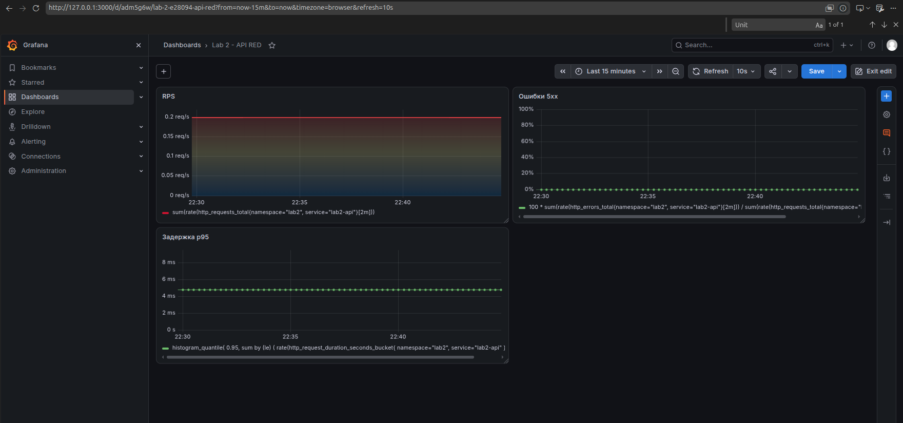
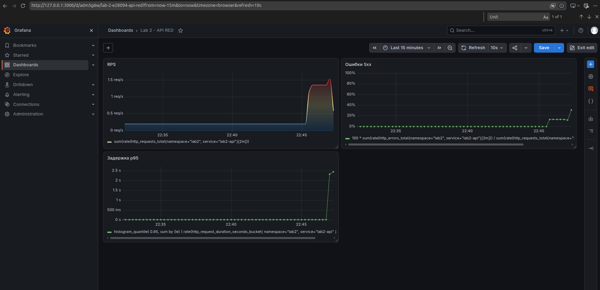

# Лабораторная работа № 2 — наблюдаемость API

[Условие лабораторной работы](https://github.com/KeladKaal/containerization-and-orchestration/blob/main-rus/lecture-2-observability/lab.md).

Развернул отдельный Go API в Kubernetes и подключил его к Prometheus и Grafana.
Собрал RED-дашборд: сколько запросов проходит, какая доля заканчивается ошибкой
и как долго приходится ждать ответа. Затем подергал ручки нагрузки и проверил,
что графики действительно реагируют, а не просто красиво нарисованы.

## Окружение

- Go `1.25.6`.
- Kind-кластер `itmo-observability`, context `kind-itmo-observability`.
- API: namespace `lab2`, Helm release `lab2-api`.
- Мониторинг: namespace `monitoring`, chart `kube-prometheus-stack 91.8.2`.
- Grafana `13.2.3`.

Выводы терминала сокращены до значимых строк, графики приведены в конце части 1.

## Часть 0 — подопытный API

Для экспериментов завайбил небольшой API на Go.
Код: [api/main.go](api/main.go), инструментирование:
[api/telemetry.go](api/telemetry.go). Внутри обычный `net/http`, небольшие
обработчики и graceful shutdown. Логи пишет `slog` в JSON на stdout.

| Запрос | Что происходит |
| --- | --- |
| `GET /health` | `200 OK`, тело `ok` |
| `GET /fail` | Намеренный `500`; растет счетчик ошибок, span помечается Error |
| `GET /slow` | Ожидание 2 секунды внутри дочернего span `slow-op` |
| `GET /slow?ms=1000` | Можно выбрать задержку от 1000 до 3000 мс |
| `GET /load` | 100 HTTP-запросов к собственному `/health`, параллельность 10 |
| `GET /load?n=50&concurrency=5&path=/fail` | Пачка из 50 намеренных ошибок |
| `GET /metrics` | Метрики в формате Prometheus |

Для `/load` разрешены только `/health`, `/fail` и `/slow`. Число запросов —
от 1 до 1000, параллельность — от 1 до 50, одновременно работает одна пачка.
Общий тайм-аут пачки — 30 секунд; отмена входящего запроса останавливает нагрузку.
При занятости генератора возвращается `503`. Произвольные URL и рекурсивный
вызов `/load` запрещены, чтобы генератор не усиливал собственную нагрузку бесконечно.

`/load` возвращает JSON с числом запрошенных, начатых, успешных и неуспешных
вызовов. Завершенная пачка может вернуть `200`, даже если ее дочерние запросы
получили `500`: результат этих вызовов виден в JSON, метриках и дочерних спанах.

### Метрики: RED

| Метрика | Тип | Зачем |
| --- | --- | --- |
| `http_requests_total` | Counter | Количество завершенных запросов; скорость роста дает RPS |
| `http_errors_total` | Counter | Количество ответов 5xx |
| `http_request_duration_seconds` | Histogram | Распределение задержек; по бакетам рассчитывается p95 |

У запросов и гистограммы метки `method`, `route`, `status`; у счетчика ошибок —
`method` и `route`. Счетчики ошибок известных маршрутов заранее созданы с нулем.
Неизвестные маршруты попадают в `route="unknown"`, нестандартные методы —
в `method="OTHER"`. Query-параметры и `trace_id` в метки не попадают: иначе
практически каждый запрос создавал бы отдельный временной ряд.

`/metrics` исключен из RED-метрик, логов запросов и трейсов: scrape не изображает
пользовательский трафик. `/health` учитывается: и self-load, и health probes
увеличивают счетчик.
Ответы 4xx учитываются в запросах и задержках, но не в счетчике 5xx.
Дополнительно экспортируются стандартные метрики Go runtime и процесса.

### Логи и трейсы

Каждый обработанный запрос, кроме `/metrics`, оставляет JSON-лог с методом,
маршрутом, HTTP-статусом, длительностью, `trace_id` и `span_id`.
Для ответов 5xx уровень — `ERROR`. В HTTP-ответе есть `X-Trace-ID`:
удобно сразу сопоставить запрос с записью лога. Логи запуска и остановки не
имеют `trace_id`, потому что не относятся к отдельному HTTP-запросу.

OpenTelemetry создает серверный span каждого запроса. У `/slow` есть дочерний
`slow-op`, у `/fail` — записанная ошибка и status Error. HTTP-клиент `/load`
передает W3C trace context: корневой запрос, исходящие вызовы и новые входящие
вызовы собираются в один trace.

OTLP endpoint в развернутом API не задан. SDK создает валидные trace IDs,
но спаны наружу не отправляются; поступление трейсов в Jaeger не проверял.

| Переменная | Назначение |
| --- | --- |
| `HTTP_ADDR` | Адрес прослушивания, по умолчанию `:8080` |
| `OTEL_SERVICE_NAME` | Имя в трейсах, по умолчанию `lab2-api` |
| `OTEL_EXPORTER_OTLP_ENDPOINT` | Базовый HTTP(S) URL приемника; экспортер добавляет `/v1/traces` |
| `OTEL_EXPORTER_OTLP_TRACES_ENDPOINT` | Полный URL для трейсов, имеет приоритет над общей переменной |

Экспортер использует OTLP/HTTP с protobuf, не gRPC. Sampling настроен на все
локально начатые трейсы, решение входящего родителя учитывается.

Документация: [HTTP-инструментирование OTel](https://pkg.go.dev/go.opentelemetry.io/contrib/instrumentation/net/http/otelhttp@v0.69.0),
[OTLP/HTTP exporter](https://pkg.go.dev/go.opentelemetry.io/otel/exporters/otlp/otlptrace/otlptracehttp@v1.44.0).

### Проверка кода

Проверки кода:

```bash
cd lab-02-observability/api
GOTOOLCHAIN=local go test -race ./...
GOTOOLCHAIN=local go vet ./...
GOTOOLCHAIN=local CGO_ENABLED=0 go build -trimpath -o /tmp/lab2-api .
```

`go test -race`, `go vet` и статическая сборка прошли успешно. Зависимости
закреплены в `go.mod` и `go.sum`; `GOTOOLCHAIN=local` оставляет установленный Go.

Автотесты: [HTTP и RED](api/api_test.go), [OTLP export](api/telemetry_test.go).
Проверяют ручки, метрики, JSON-логи, дочерний `slow-op`, self-requests,
передачу trace context и отправку protobuf-трейсов на тестовый HTTP-приемник.

[Dockerfile](api/Dockerfile) собирает статический бинарник в builder stage
и переносит его в `scratch` вместе с CA certificates. Запуск — от UID/GID
`65532`, через exec-form entrypoint.

## Запуск API в Kubernetes

Из каталога второй лабы собрал образ и загрузил его в kind:

```bash
docker build -t lab2-api:dev api
kind load docker-image lab2-api:dev --name itmo-observability
```

В `crictl images` на ноде появился `lab2-api:dev`, размер около `15.4 MB`.
Нода кластера `itmo-observability` была в состоянии `Ready`.

Chart: [charts/lab2-api](charts/lab2-api). При первоначальной установке
создаются Deployment и Service. ServiceMonitor включил отдельными
[scrape values](observability/api-scrape-values.yaml).

- Deployment поддерживает нужное число Pod и управляет их заменой.
- Service типа ClusterIP дает постоянный внутренний адрес и выбирает Pod
  по labels. Его selector совпадает с labels Pod из Deployment.
- Readiness проверяет `/health`: неготовый Pod не получает обычный трафик
  через Service, но сама эта проверка не перезапускает контейнер.
- Startup probe дает приложению время запуститься; после ее успеха
  начинает работать readiness. Liveness не добавлял, чтобы не смешивать
  проверку доступности с автоматическими рестартами во время экспериментов.

Настройки в [values.yaml](charts/lab2-api/values.yaml): одна реплика,
локальный образ с `imagePullPolicy: Never`, requests `100m / 32Mi`,
limits `500m / 128Mi`. `Never` подходит этому стенду с заранее загруженным
образом.
Контейнер работает без root, с read-only root filesystem, без capabilities
и без автоматически смонтированного токена Kubernetes API.

При первоначальной установке OTLP export и scrape были выключены.
Scrape подключил отдельно; проверки `/health` дают небольшой фоновый RPS.

### Установка API

Из папки второй лабы:

```bash
export KUBECONFIG="/home/david/.kube/itmo-observability.yaml"

helm lint ./charts/lab2-api --strict

helm upgrade --install lab2-api ./charts/lab2-api \
  --kube-context kind-itmo-observability \
  --namespace lab2 \
  --create-namespace \
  --wait \
  --timeout 2m

kubectl -n lab2 rollout status deployment/lab2-api --timeout=120s
kubectl -n lab2 get pods,svc
```

В отдельном терминале открыл доступ к API:

```bash
export KUBECONFIG="/home/david/.kube/itmo-observability.yaml"
kubectl -n lab2 port-forward service/lab2-api 18080:8080
```

Порт `18080` выбрал, чтобы не пересекаться с уже запущенными сервисами.
Port-forward дает временный локальный доступ; Service остается внутренним.

Проверил ручки, метрики и логи:

```bash
curl --max-time 5 -i http://127.0.0.1:18080/health
curl --max-time 5 -i http://127.0.0.1:18080/fail
curl --max-time 5 -i http://127.0.0.1:18080/slow
curl --max-time 35 -i 'http://127.0.0.1:18080/load?n=20&concurrency=5'
curl --max-time 5 -sS http://127.0.0.1:18080/metrics | rg '^http_(requests_total|errors_total|request_duration_seconds)'
kubectl -n lab2 logs deployment/lab2-api --tail=15
```

### Результат

Установка прошла: Helm release `lab2-api`, namespace `lab2`, revision 1,
`STATUS: deployed`. Rollout завершился успешно.

```text
NAME                            READY   STATUS    RESTARTS
pod/lab2-api-86d6f56944-95wsr   1/1     Running   0

NAME               TYPE        CLUSTER-IP      PORT(S)
service/lab2-api   ClusterIP   10.96.219.244   8080/TCP
```

Ручки отработали: `/health` — 200, `/fail` — намеренный 500,
`/slow` — `slept for 2000 ms`. Результат вызова
`/load?n=20&concurrency=5`:

```json
{"path":"/health","requested":20,"attempted":20,"succeeded":20,"failed":0}
```

В момент проверки метрики содержали:

```text
http_errors_total{method="GET",route="/fail"} 1
http_requests_total{method="GET",route="/health",status="200"} 74
http_request_duration_seconds_count{method="GET",route="/slow",status="200"} 1
```

`74` у `/health` — не только ручные запросы: туда входят self-load и
проверки Kubernetes. В логах дочерних вызовов `/health` и их родительского
`/load` совпал `trace_id=77704683c6843b1316f54365f8ed8cec`, а `span_id`
различались — контекст передается между запросами.

Документация: [Deployment](https://kubernetes.io/docs/concepts/workloads/controllers/deployment/),
[Service](https://kubernetes.io/docs/concepts/services-networking/service/),
[probes](https://kubernetes.io/docs/concepts/workloads/pods/probes/),
[структура Helm chart](https://helm.sh/docs/topics/charts/).

## Часть 1 — подключение scrape к Prometheus

Для метрик использовал уже установленный `kube-prometheus-stack 91.8.2`:
release `monitoring`, namespace `monitoring`. Prometheus, Operator и Grafana
работали в состоянии `Running`.

Проверил selectors у `Prometheus/monitoring-prometheus`:

```yaml
serviceMonitorSelector:
  matchLabels:
    release: monitoring
serviceMonitorNamespaceSelector: {}
```

Первый selector выбирает ServiceMonitor по его меткам; пустой namespace
selector разрешает выбирать мониторы из всех namespaces, включая `lab2`.
У Prometheus есть права discovery ресурсов в `lab2`.

В [ServiceMonitor](charts/lab2-api/templates/servicemonitor.yaml) указаны
метки нужного Service, имя его порта `http`, путь `/metrics`,
интервал 15 секунд и тайм-аут 5 секунд. Сам ServiceMonitor не ходит за
метриками: Operator превращает это описание в конфигурацию Prometheus,
а Prometheus опрашивает найденные адреса Pod.

Включил ServiceMonitor через
[api-scrape-values.yaml](observability/api-scrape-values.yaml).
Его метка `release: monitoring` нужна для отбора экземпляром Prometheus;
сам ресурс принадлежит Helm release `lab2-api`.

### Подключение scrape

Из папки второй лабы:

```bash
export KUBECONFIG="/home/david/.kube/itmo-observability.yaml"

helm upgrade --install lab2-api ./charts/lab2-api \
  --kube-context kind-itmo-observability \
  --namespace lab2 \
  --values ./observability/api-scrape-values.yaml \
  --wait \
  --timeout 2m

kubectl -n lab2 get servicemonitor lab2-api --show-labels
```

Scrape-настройки вынес в отдельный values-файл. Сброс values или новый набор
без этих настроек может удалить ServiceMonitor из release; простой upgrade
без новых values сохраняет предыдущую пользовательскую конфигурацию.

Открыл Prometheus через port-forward:

```bash
export KUBECONFIG="/home/david/.kube/itmo-observability.yaml"
kubectl -n monitoring port-forward service/monitoring-prometheus 19090:9090
```

### Результат scrape

Helm upgrade завершился: revision 2, `STATUS: deployed`. ServiceMonitor
`lab2/lab2-api` получил метку `release=monitoring`. На странице
`http://127.0.0.1:19090/targets` нашел нужный target:

```text
Scrape pool: serviceMonitor/lab2/lab2-api/0
Endpoint:    http://10.244.0.11:8080/metrics
State:       UP (1/1)
```

В Query проверил:

```promql
up{namespace="lab2", service="lab2-api"}
```

Получил `1` — последний scrape успешен. Затем запросил прикладную метрику:

```promql
http_requests_total{namespace="lab2", service="lab2-api"}
```

Четыре ряда: `/fail` — 1 (500), `/health` — 371 (200), `/load` — 1 (200),
`/slow` — 1 (200). Это накопленные счетчики на момент проверки, не RPS.
В рост `/health` входят проверки Kubernetes.

`up=1` не означает, что все ручки API успешны: `/fail` может отдавать 500,
а `/metrics` при этом исправно отдавать метрики.

Документация: [ServiceMonitor и Operator](https://prometheus-operator.dev/docs/developer/getting-started/),
[значение up](https://prometheus.io/docs/concepts/jobs_instances/).

## Часть 1 — RED-дашборд в Grafana

В Grafana создал отдельный дашборд `Lab 2 — API RED`.
Источник `Prometheus` уже был настроен на
`http://monitoring-prometheus.monitoring:9090/` внутри кластера.
Grafana запрашивает данные у Prometheus, а не напрямую у `/metrics` приложения.

Для доступа к Grafana открыл еще один port-forward:

```bash
export KUBECONFIG="/home/david/.kube/itmo-observability.yaml"
kubectl -n monitoring port-forward service/monitoring-grafana 3000:80
```

В `http://127.0.0.1:3000` добавил три панели `Time series` с источником
`Prometheus`, редактором `Code` и типом запросов `Range`.
Выбрал последние 15 минут, автообновление раз в `10s`.

### Rate — запросы в секунду

Название панели: `RPS`. Unit: `suffix:req/s`, Min: `0`, Max: auto.

```promql
sum(rate(http_requests_total{namespace="lab2", service="lab2-api"}[2m]))
```

`rate` считает среднюю скорость роста счетчика за последние две минуты,
в запросах за секунду, с учетом сбросов при рестарте. Затем `sum` объединяет
маршруты, статусы и реплики. Окно `2m` — не интервал scrape: scrape остается `15s`.

### Errors — доля 5xx

Название панели: `Ошибки 5xx`. Unit: `Percent (0-100)`, Min: `0`, Max: `100`.

```promql
100 *
sum(rate(http_errors_total{namespace="lab2", service="lab2-api"}[2m]))
/
sum(rate(http_requests_total{namespace="lab2", service="lab2-api"}[2m]))
```

Скорость ошибок делю на скорость всех запросов за то же окно. Просто
показывать число ошибок недостаточно: 20 ошибок из 20 и из 10000 запросов —
разные ситуации. При нулевом трафике доля не определена, а не равна нулю.

### Duration — p95 времени ответа

Название панели: `Задержка p95`. Unit: `seconds (s)`, Min: `0`, Max: auto.

```promql
histogram_quantile(
  0.95,
  sum by (le) (
    rate(http_request_duration_seconds_bucket{
      namespace="lab2", service="lab2-api"
    }[2m])
  )
)
```

p95 — оценка границы, не дольше которой завершились примерно 95% запросов
в окне. При суммировании сохранил `le` — верхнюю границу бакета:
без нее нельзя восстановить распределение. Результат приближенный,
поскольку гистограмма хранит бакеты, а не точное время каждого запроса.

### Проверка реакции графиков

Через API на `18080` запустил три пачки: обычные запросы, ошибки и задержки.
`/health` из дашборда не исключал: на него идут probes и обычный self-load.
Для задержки вызвал 20 `/slow`, чтобы медленные запросы не потерялись
среди быстрых проверок здоровья.

```console
$ curl --max-time 10 -sS 'http://127.0.0.1:18080/load?n=100&concurrency=5'
{"path":"/health","requested":100,"attempted":100,"succeeded":100,"failed":0}
$ curl --max-time 10 -sS 'http://127.0.0.1:18080/load?n=20&concurrency=5&path=/fail'
{"path":"/fail","requested":20,"attempted":20,"succeeded":0,"failed":20}
$ curl --max-time 20 -sS 'http://127.0.0.1:18080/load?n=20&concurrency=5&path=/slow'
{"path":"/slow","requested":20,"attempted":20,"succeeded":20,"failed":0}
```

Все запрошенные вызовы были выполнены. У `/fail` все 20 ответов — намеренные
ошибки; это ожидаемый результат опыта, а не потеря запросов генератором.

До нагрузки, снимок 9 октября 2026 года в 22:44:55: RPS около `0.2`,
ошибок `0%`, оценка p95 около `4.75 ms`.



После трех пачек, снимок в 22:47:20: RPS вырос примерно до `1.5 req/s`,
доля 5xx — примерно до `30%`, p95 — примерно до `2.4 s`. Все три панели
реагируют на соответствующие эксперименты.



Ошибки не достигли 100%: в том же окне были успешные `/health`, probes,
`/slow` и родительские `/load`. При выходе быстрых запросов из окна доля ошибок
может временно расти даже без новых 500. Окно `2m` сглаживает графики,
это не мгновенный RPS.

p95 — не среднее. Один медленный запрос из тысячи может остаться за этой
границей, а пачка из 20 уже заметно меняет распределение. Сам `/load` тоже
учитывается и при медленной пачке добавляет один долгий запрос.

Гистограмма не хранит точные длительности. Первый бакет заканчивается на
`5 ms`, поэтому оценка p95 `4.75 ms` не означает, что probes занимают почти 5ms.
У `/slow` измеренная длительность чуть больше заданных 2s попадает в бакет до
2.5s. Отсюда p95 около `2.4 s`, а не ровно две секунды.

Документация: [создание дашборда Grafana](https://grafana.com/docs/grafana/latest/visualizations/dashboards/build-dashboards/create-dashboard/),
[единицы измерения](https://grafana.com/docs/grafana/latest/visualizations/panels-visualizations/configure-standard-options/),
[rate и histogram_quantile](https://prometheus.io/docs/prometheus/latest/querying/functions/).

## Итог по метрикам

Развернул API через Helm, настроил scrape с интервалом 15 секунд и собрал
три RED-панели. Опыты показали рост RPS, доли ошибок и p95. По этим графикам
видно не только, что процесс жив, но и как он отвечает на запросы.

Код, Helm chart, scrape values и два скриншота сохранены в репозитории.
JSON-экспорт дашборда еще не сохранен. Сбор логов в Loki, хранение трейсов
в Jaeger и правила алертов в этой части не настроены.
